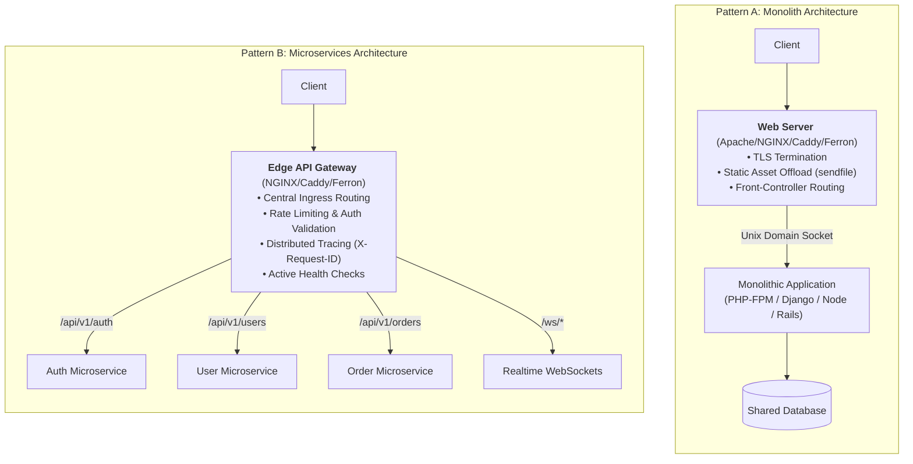

# 03. Web Servers in Monolith vs. Microservices

The architectural role of a web server changes dramatically depending on whether your system is a **Monolith** or a **Microservices** fleet.

---

## 1. Architectural Topology Comparison

---

## 2. Monolith Pattern: The Front Shield

In a monolithic application, the web server is tightly coupled with the host operating system:

1. **Static Asset Offloading**: Images, CSS, and compiled JavaScript are served directly from disk via `sendfile`, never touching application memory.
2. **Local Socket Multiplexing**: Instead of communicating over TCP loopback (`127.0.0.1`), the web server connects to the app server via **Unix Domain Sockets** (`/run/app.sock`), cutting latency by ~25% and avoiding TCP port exhaustion.
3. **Front-Controller Pattern**: Directs all non-static requests to a single entrypoint script (`index.php`, `app.js`, `wsgi.py`).
4. **Edge Microcaching**: Caches database-heavy GET requests for 1–5 seconds to absorb viral traffic spikes without hitting the monolith runtime.

---

## 3. Microservices Pattern: The Edge API Gateway

In a distributed microservice architecture, the web server acts as an intelligent Layer 7 router and gatekeeper:

1. **Path & Host Routing**: Dispatches requests based on URI prefixes (`/api/v1/users` $\rightarrow$ User Service pool; `/api/v1/billing` $\rightarrow$ Billing Service pool).
2. **Dynamic Load Balancing**: Distributes traffic across dynamic container IPs using algorithms such as `least_conn`, `round_robin`, or IP hashing.
3. **Active Health Checking**: Continuously probes backend instances via `/healthz` endpoints and automatically isolates unhealthy pods before client traffic is affected.
4. **Distributed Tracing**: Generates and propagates a correlation ID (`X-Request-ID`) across every downstream service to enable end-to-end tracing in Jaeger, Datadog, or Loki.
5. **Rate Limiting & Abuse Prevention**: Enforces leaky bucket limits to prevent noisy neighbors from exhausting backend databases.
6. **Zero-Trust mTLS**: Terminates external TLS and re-encrypts traffic internally using mutual TLS between microservices.

---

**Previous:** [02. How Web Servers Work](./02-how-web-servers-work.md) | **Next:** [02. Apache: 01. Installation & Setup](../02-apache/01-installation-and-setup.md)

