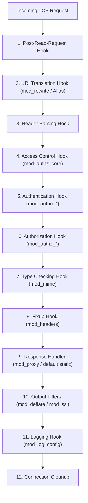

# 02. Apache: Core Concepts & Overview

Understanding Apache’s origins, architectural philosophy, and practical trade-offs is essential when evaluating whether to maintain, optimize, or migrate away from it.

---

## 1. What is Apache HTTP Server?

Created in 1995 by Robert McCool and Brian Behlendorf as a set of patches for the NCSA HTTPd daemon (hence **"A PAtCHy server"**), Apache became the bedrock of the World Wide Web, powering over 60% of all websites during the dot-com era and 2000s.

Written in **C**, Apache was architected with a heavily **modular design**: the core server handles basic socket lifecycle and connection dispatching, while virtually every feature—SSL, rewrites, compression, authentication, and proxying—is implemented as a dynamically loadable module (`.so`).

---

## 2. Why Use Apache? (The Strengths)

1. **Decentralized Configuration (`.htaccess`)**:
   * Developers can override routing, security headers, and authentication on a per-directory basis without root access or reloading the server.
   * Ideal for shared hosting, universities, and legacy content management systems (WordPress, Drupal, Joomla).

2. **Vast Enterprise Module Ecosystem**:
   * Decades of battle-tested modules for legacy enterprise protocols: `mod_auth_kerb`, `mod_auth_ldap`, `mod_security` (WAF), `mod_shib` (SAML).

3. **Dynamic Content Modules**:
   * Historical ability to embed language runtimes directly into the process (`mod_perl`, `mod_php`, `mod_python`, `mod_tcl`).

---

## 3. Why NOT Use Apache? (The Weaknesses)

1. **High Memory Overhead**:
   * Even with `mpm_event`, Apache consumes 150MB–400MB per 10,000 idle Keep-Alive connections, whereas NGINX and Ferron consume 25MB–50MB.
2. **Filesystem Traversal Overhead**:
   * If `.htaccess` is enabled (`AllowOverride All`), Apache calls `stat()` on every directory level from the root to the target file for every single request, degrading disk I/O performance.
3. **Configuration Complexity**:
   * XML-style tags (`<VirtualHost>`, `<Directory>`, `<Location>`, `<Files>`) have complex precedence rules that frequently lead to security bypasses if misunderstood.

---

## 4. How Apache Works: The Hook Architecture

When an HTTP request enters Apache, it passes through a 16-phase **Hook Pipeline**:

Every module registers callbacks at specific hook phases, allowing Apache to transform headers, evaluate auth, rewrite paths, or compress payloads at each distinct step.
