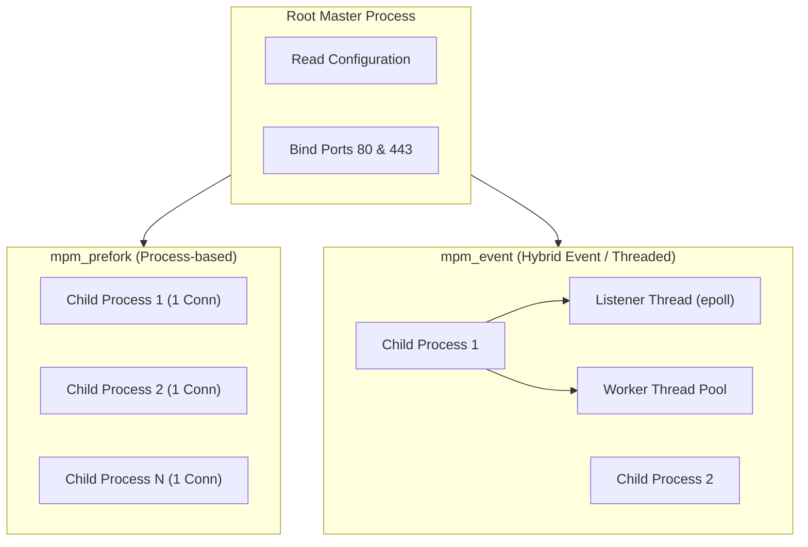

# 03. Apache: Architecture & MPM Engine

Apache’s concurrency behavior is governed by **Multi-Processing Modules (MPMs)**. Understanding how MPMs function is essential for properly sizing and tuning Apache in production.

---

## 1. Multi-Processing Modules (MPM) Deep Dive



### 1. `mpm_prefork` (Legacy)
* **Model:** Spawns isolated single-threaded child processes. Each child handles exactly one connection at a time.
* **Pros:** Thread-safe. Immune to thread race conditions.
* **Cons:** High memory usage (30MB–80MB per process). Poor concurrency scaling.
* **When to use:** Only when required by non-thread-safe legacy C libraries.

### 2. `mpm_worker` (Multi-Process Multi-Thread)
* **Model:** Each child process spawns multiple worker threads. Each thread handles one connection.
* **Pros:** Lower memory consumption than `prefork`.
* **Cons:** An idle Keep-Alive connection blocks a worker thread until the timeout expires.

### 3. `mpm_event` (Modern Default)
* **Model:** Solves the Keep-Alive problem by dedicating a listener thread to monitor idle sockets via `epoll`.
* **Pros:** Handles 10,000+ simultaneous connections with low memory footprint.
* **Production Recommendation:** Always use `mpm_event` for modern deployments.

---

## 2. Production `mpm_event.conf` Tuning

```apache
# /etc/apache2/mods-available/mpm_event.conf
<IfModule mpm_event_module>
    StartServers             4
    MinSpareThreads          75
    MaxSpareThreads          250
    ThreadLimit              64
    ThreadsPerChild          32
    MaxRequestWorkers        1024
    MaxConnectionsPerChild   10000
    AsyncRequestWorkerFactor 2
</IfModule>
```

### Formula for Sizing:
$$\text{MaxRequestWorkers} = \text{Total Server RAM allocated to Apache} / \text{Average Child Process RAM}$$
* If each child process with 32 threads consumes 100MB of RAM, and you allocate 3.2GB RAM to Apache:
  $$\text{Child Processes} = 3200\text{MB} / 100\text{MB} = 32$$
  $$\text{MaxRequestWorkers} = 32 \times 32 = 1024$$

---

## 3. Configuration Scopes & Precedence

Directives in Apache apply according to a strict hierarchy:

1. `<Directory "/var/www/...">` (Filesystem paths, processed shortest to longest)
2. `<DirectoryMatch regex>`
3. `<Files "filename">` and `<FilesMatch regex>`
4. `<Location "/url/path">` (Evaluated on the request URL)

> [!CAUTION]
> Never use `<Location>` to restrict access to filesystem files. URL encoding tricks (`/dir/..;/secret`) can bypass `<Location>` blocks. Always enforce filesystem access restrictions inside `<Directory>` blocks!
