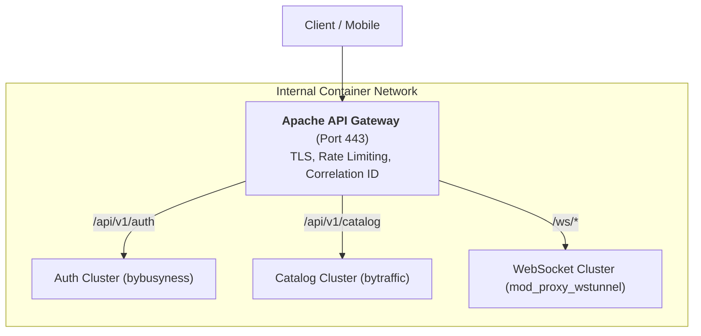

# 05. Apache: Microservices & Reverse Proxy

In a microservices architecture, Apache can act as an API Gateway and Layer 7 load balancer by combining `mod_proxy`, `mod_proxy_balancer`, `mod_proxy_hcheck`, and `mod_proxy_wstunnel`.

---

## 1. Microservices Gateway Topology



---

## 2. Production Gateway Configuration

```apache
<VirtualHost *:443>
    ServerName gateway.company.internal
    SSLEngine on
    SSLCertificateFile /etc/ssl/certs/gateway.crt
    SSLCertificateKeyFile /etc/ssl/private/gateway.key

    # 1. Distributed Tracing: Auto-inject unique correlation ID
    RequestHeader setifempty X-Request-ID "%{UNIQUE_ID}e"
    ProxyPreserveHost On

    # 2. Upstream Pool: Auth Microservice (Least Busy Worker)
    <Proxy "balancer://auth_cluster">
        BalancerMember "http://auth-1:8080" route=node1 hcmethod=GET hcuri=/healthz hcinterval=5
        BalancerMember "http://auth-2:8080" route=node2 hcmethod=GET hcuri=/healthz hcinterval=5
        ProxySet lbmethod=bybusyness
    </Proxy>

    # 3. Upstream Pool: Catalog Microservice (Weighted Traffic)
    <Proxy "balancer://catalog_cluster">
        BalancerMember "http://cat-1:8080" loadfactor=3
        BalancerMember "http://cat-2:8080" loadfactor=1
        BalancerMember "http://cat-backup:8080" status=+H # Hot standby
        ProxySet lbmethod=bytraffic
    </Proxy>

    # 4. Path-Based Ingress Routing
    ProxyPass /api/v1/auth/ balancer://auth_cluster/api/v1/auth/
    ProxyPassReverse /api/v1/auth/ balancer://auth_cluster/api/v1/auth/

    ProxyPass /api/v1/catalog/ balancer://catalog_cluster/api/v1/catalog/
    ProxyPassReverse /api/v1/catalog/ balancer://catalog_cluster/api/v1/catalog/

    # 5. Realtime WebSocket Proxying
    ProxyPass /ws/ ws://notifications:9000/
    ProxyPassReverse /ws/ ws://notifications:9000/

    # Gateway Timeout Protection
    ProxyTimeout 30
</VirtualHost>
```

---

## 3. Load Balancing Algorithms

* `bybusyness`: Keeps track of active requests per worker and dispatches to the least busy node. (Equivalent to `least_conn` in NGINX). **Recommended for microservices**.
* `bytraffic`: Balances based on byte count transferred. Ideal for services handling large, varying payloads.
* `byrequests`: Standard round-robin request distribution.
* `status=+H`: Designates a hot standby node that only receives traffic if all primary members fail health checks.
