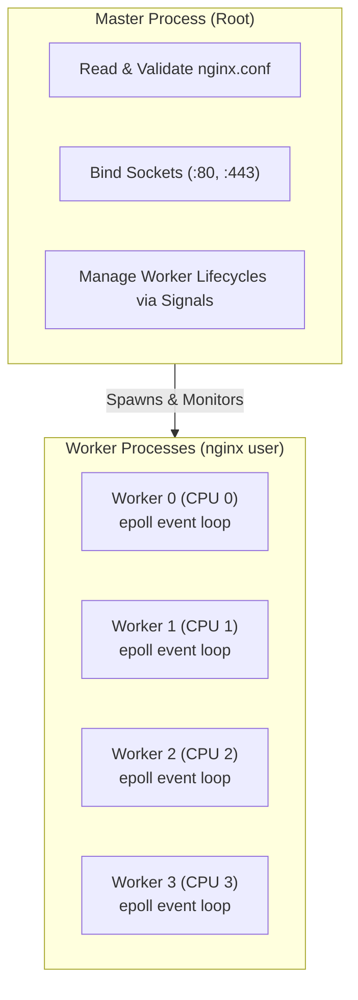
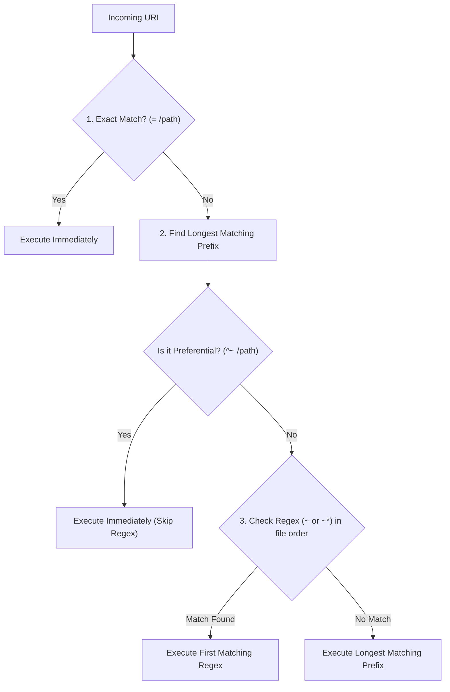
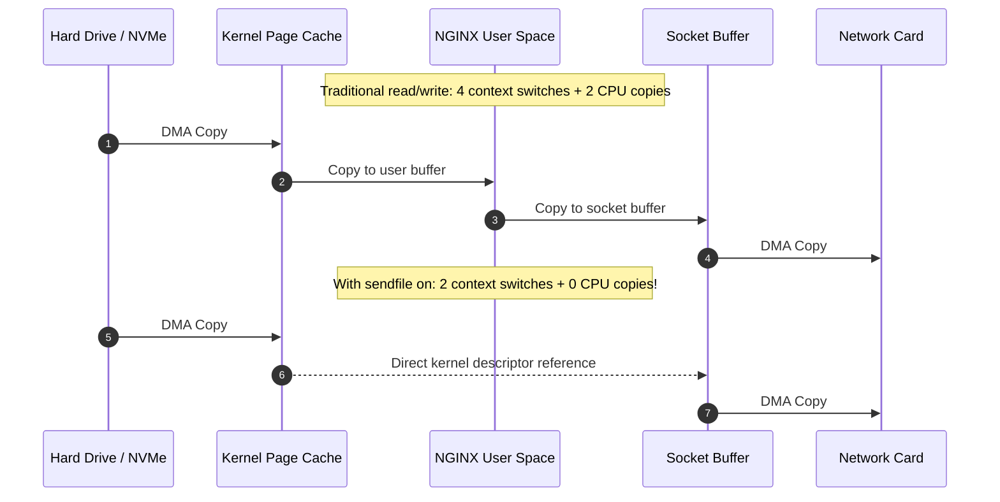

# 03. NGINX: Architecture & Internals

Deep dive into NGINX's internal master-worker process architecture, CPU affinity, location matching priority algorithm, and zero-copy data path.

---

## 1. Master-Worker Process Model



### Key Directives for Core Sizing:
```nginx
# 1. Spawn 1 worker per CPU core
worker_processes auto;

# 2. Pin workers to specific CPU cores to avoid cache thrashing
worker_cpu_affinity auto;

# 3. Maximum file descriptors per worker (conns + open files)
worker_rlimit_nofile 65535;

events {
    # Max connections per worker
    worker_connections 16384;
    use epoll;
    multi_accept on;
}
```

---

## 2. Location Matching Priority Algorithm

NGINX evaluates `location` blocks using a deterministic algorithm:



### Hierarchy Rules:
1. `=` : **Exact Match**. Highest priority. Evaluation stops immediately.
2. `^~` : **Preferential Prefix**. If this is the longest prefix match, regex evaluation is skipped.
3. `~` / `~*` : **Regular Expressions** (`~` case-sensitive, `~*` case-insensitive). Evaluated in the exact order they appear in the file.
4. Standard Prefix (no modifier): Lowest priority. Fallback if no regex matches.

---

## 3. Zero-Copy Architecture (`sendfile`)

When serving static files, `sendfile` eliminates user-space context switches:



### Configuration Directives:
```nginx
http {
    sendfile on;          # Enables direct kernel file transfer
    tcp_nopush on;        # Sends HTTP header and file start in one packet
    tcp_nodelay on;       # Disables Nagle's algorithm for interactive low latency
    keepalive_timeout 65;
}
```
