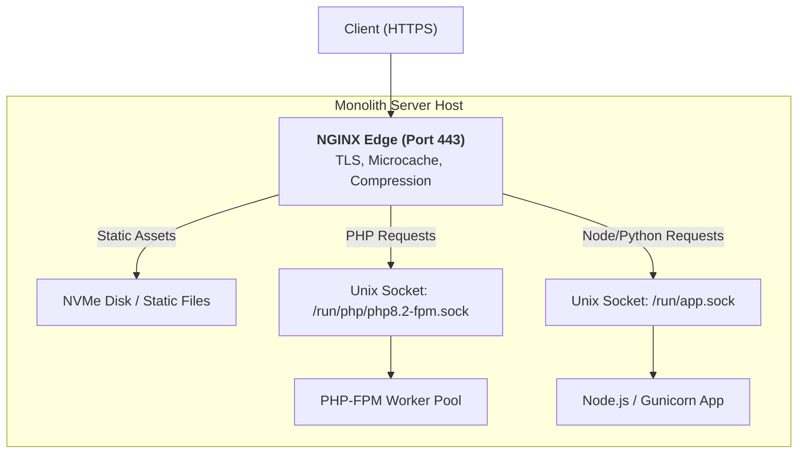

# 04. NGINX: Monolith Deployments

In monolithic architectures, NGINX acts as the high-performance front shield. It handles TLS termination, streams static assets directly from disk, and forwards dynamic requests to application runtimes via low-latency Unix domain sockets.

---

## 1. Monolith Architecture Overview



---

## 2. Production Monolith: PHP-FPM (Laravel / WordPress)

```nginx
server {
    listen 80;
    server_name app.company.com;
    return 301 https://$host$request_uri;
}

server {
    listen 443 ssl http2;
    server_name app.company.com;

    root /var/www/app/public;
    index index.php index.html;

    # SSL Configuration
    ssl_certificate /etc/ssl/certs/app.crt;
    ssl_certificate_key /etc/ssl/private/app.key;
    ssl_protocols TLSv1.2 TLSv1.3;
    ssl_ciphers HIGH:!aNULL:!MD5;

    # 1. Static Asset Caching
    location ~* \.(jpg|jpeg|png|gif|ico|css|js|woff2|webp)$ {
        expires 365d;
        access_log off;
        add_header Cache-Control "public, no-transform, immutable";
        try_files $uri =404;
    }

    # 2. Front-Controller Pattern (Laravel / Symfony)
    location / {
        try_files $uri $uri/ /index.php?$query_string;
    }

    # 3. FastCGI Processing via Unix Domain Socket
    location ~ \.php$ {
        fastcgi_split_path_info ^(.+\.php)(/.+)$;
        fastcgi_pass unix:/run/php/php8.2-fpm.sock;
        fastcgi_index index.php;

        include fastcgi_params;
        fastcgi_param SCRIPT_FILENAME $realpath_root$fastcgi_script_name;
        fastcgi_param DOCUMENT_ROOT $realpath_root;

        # FastCGI Buffering Tuning
        fastcgi_buffering on;
        fastcgi_buffer_size 16k;
        fastcgi_buffers 16 16k;
        fastcgi_busy_buffers_size 32k;
    }

    # Deny access to hidden files (.env, .git)
    location ~ /\. {
        deny all;
        access_log off;
        log_not_found off;
    }
}
```

---

## 3. Edge Microcaching for Monoliths

Microcaching caches dynamic GET requests for 1 to 5 seconds, allowing a monolith to absorb massive traffic spikes:

```nginx
# Define cache zone in http context
proxy_cache_path /var/cache/nginx levels=1:2 keys_zone=MICROCACHE:10m max_size=1g inactive=60m use_temp_path=off;

server {
    ...
    location /api/products {
        proxy_pass http://unix:/run/app.sock;
        proxy_cache MICROCACHE;
        proxy_cache_valid 200 302 2s; # Cache for 2 seconds
        proxy_cache_valid 404 1m;

        # Thundering Herd Prevention
        proxy_cache_lock on;
        proxy_cache_use_stale error timeout updating http_500 http_502 http_503;

        add_header X-Cache-Status $upstream_cache_status;
    }
}
```
