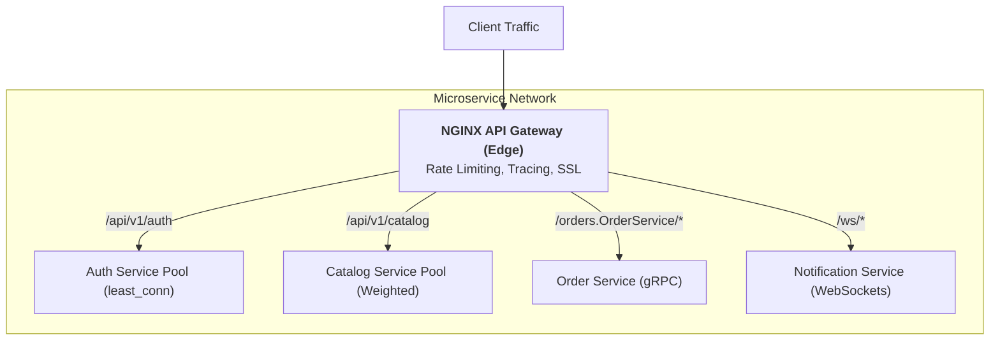

# 05. NGINX: Microservices API Gateway

In a microservices architecture, NGINX acts as the Edge API Gateway. It centralizes routing, rate limiting, connection pooling, and protocol translation (HTTP/1.1, HTTP/2, HTTP/3, WebSockets, gRPC).

---

## 1. Gateway Topology



---

## 2. Production API Gateway Configuration

```nginx
# 1. WebSocket Upgrade Mapping
map $http_upgrade $connection_upgrade {
    default upgrade;
    ''      close;
}

# 2. Leaky Bucket Rate Limiting (20 req/sec per IP)
limit_req_zone $binary_remote_addr zone=api_limit:10m rate=20r/s;
limit_conn_zone $binary_remote_addr zone=conn_limit:10m;

# 3. Upstream Service Pools
upstream auth_service {
    least_conn;
    server 10.0.1.10:8080 max_fails=3 fail_timeout=10s;
    server 10.0.1.11:8080 max_fails=3 fail_timeout=10s;
    keepalive 64;
}

upstream catalog_service {
    server 10.0.2.10:8080 weight=3;
    server 10.0.2.11:8080 weight=1;
    server 10.0.2.99:8080 backup; # Hot standby
    keepalive 64;
}

upstream grpc_orders {
    server 10.0.3.10:50051;
    server 10.0.3.11:50051;
    keepalive 32;
}

server {
    listen 443 ssl http2;
    server_name api.company.com;

    # SSL Configuration
    ssl_certificate /etc/ssl/certs/api.crt;
    ssl_certificate_key /etc/ssl/private/api.key;

    # Distributed Tracing Header
    add_header X-Request-ID $request_id always;

    # Enforce Rate Limiting
    limit_req zone=api_limit burst=30 nodelay;
    limit_conn conn_limit 50;

    # Shared Upstream Headers
    proxy_http_version 1.1;
    proxy_set_header Connection ""; # Required for upstream keepalive
    proxy_set_header Host $host;
    proxy_set_header X-Real-IP $remote_addr;
    proxy_set_header X-Forwarded-For $proxy_add_x_forwarded_for;
    proxy_set_header X-Request-ID $request_id;

    # Route 1: Auth Microservice
    location /api/v1/auth/ {
        proxy_pass http://auth_service;
        proxy_connect_timeout 3s;
        proxy_read_timeout 10s;
    }

    # Route 2: Catalog Microservice
    location /api/v1/catalog/ {
        proxy_pass http://catalog_service;
        proxy_connect_timeout 3s;
        proxy_read_timeout 10s;
    }

    # Route 3: gRPC Service
    location /orders.OrderService/ {
        grpc_pass grpc://grpc_orders;
        grpc_connect_timeout 5s;
        grpc_read_timeout 30s;
    }

    # Route 4: WebSockets
    location /ws/ {
        proxy_pass http://catalog_service;
        proxy_set_header Upgrade $http_upgrade;
        proxy_set_header Connection $connection_upgrade;
        proxy_read_timeout 3600s;
    }

    # Health Check for Cloud Load Balancer
    location = /healthz {
        access_log off;
        return 200 "healthy\n";
    }
}
```

---

## 3. Upstream Keepalives: Why They Are Mandatory

By default, NGINX uses HTTP/1.0 for upstream requests and closes the socket after every response.
In microservices handling 5,000 RPS, this causes:
1. Continuous TCP 3-way handshake latency (1–5ms overhead per hop).
2. Ephemeral port exhaustion (`TIME_WAIT` socket buildup).

**Solution**:
Always set `keepalive <count>;` in the `upstream` block and `proxy_http_version 1.1; proxy_set_header Connection "";` in the `location` block.
