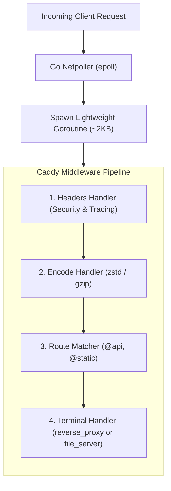

# 02. Caddy: Core Concepts & Overview

Caddy represents the modern generation of cloud-native web servers. By rethinking defaults around security and developer ergonomics, it has transformed how engineering teams manage TLS and reverse proxies.

---

## 1. What is Caddy?

Created in 2015 by **Matt Holt**, Caddy is an open-source, extensible web server and reverse proxy written entirely in **Go**.

It is famous for being the **first web server to enable automatic HTTPS by default**. If you give Caddy a domain name, it handles certificate procurement, OCSP stapling, HTTP-to-HTTPS redirection, and renewal without any external plugins or cron jobs.

---

## 2. Why Use Caddy? (The Strengths)

1. **Zero-Ops Automatic HTTPS**:
   * Uses ACME (Let's Encrypt / ZeroSSL) natively. No Certbot, no cert renew cron jobs, no expired certificate outages.
2. **Memory Safety**:
   * Written in Go. Immune to classic C memory corruption bugs, buffer overflows, and use-after-free vulnerabilities.
3. **HTTP/3 & Modern Protocols Out-of-the-Box**:
   * HTTP/3 (QUIC) and modern TLS (1.2/1.3) are enabled by default.
4. **Readable & Concise Configuration (`Caddyfile`)**:
   * Replaces 30 lines of NGINX configuration with 3 lines in Caddy.
5. **Dynamic REST JSON API**:
   * You can dynamically inspect, update, and patch the server's configuration in real time via `http://localhost:2019/load` without restarting or writing files.

---

## 3. Why NOT Use Caddy? (The Weaknesses)

1. **Go Runtime & Garbage Collection**:
   * Consumes more baseline RAM (30MB–60MB) compared to NGINX or Ferron (<10MB). Under extreme throughput (100k+ RPS), Go GC pauses can introduce microsecond jitter.
2. **Third-Party Module Ecosystem**:
   * While Caddy has a vibrant plugin ecosystem (via `xcaddy`), it does not match the 25-year-old catalog of enterprise modules available for Apache or NGINX.

---

## 4. How Caddy Works: Go Goroutines & Handler Chains

Each connection is managed by a lightweight Go **goroutine**. Caddy executes requests through a sequential, deterministic pipeline of middleware handlers (encoding, routing, proxying) before returning the response.
