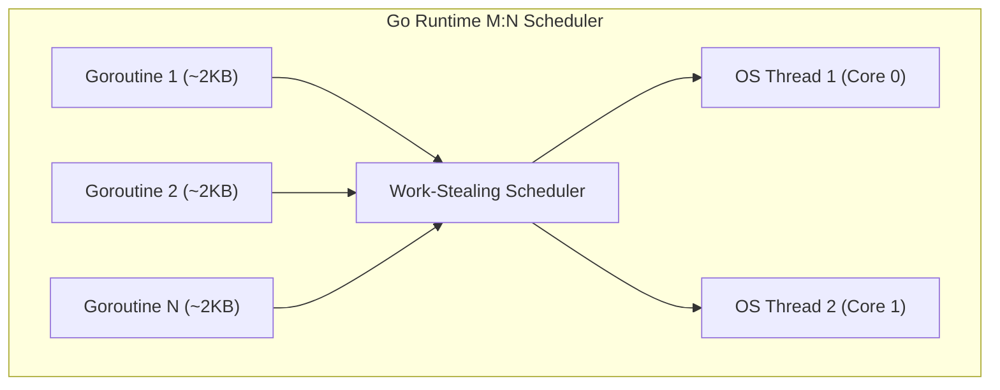
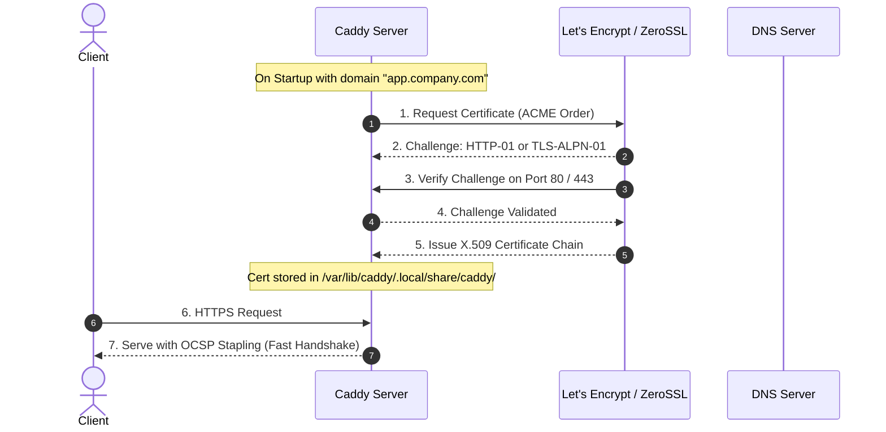
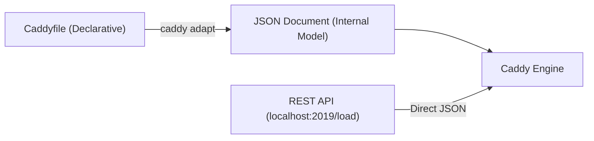

# 03. Caddy: Architecture & Automatic HTTPS

Deep dive into Caddy’s Go concurrency architecture, the mechanics of Automatic HTTPS, and the duality between the declarative `Caddyfile` and the imperative JSON REST API.

---

## 1. Concurrency Model: Go M:N Goroutine Scheduler

Unlike NGINX’s single-threaded event loop per worker, Caddy uses Go’s M:N scheduler:
* **Initial Stack Size**: Each connection spawns a goroutine with an initial stack of just **2KB** (dynamically expanding and contracting).
* **Work-Stealing Scheduler**: Maps thousands of goroutines ($M$) across a fixed pool of OS threads ($N$) matching the system's logical CPU cores.
* **Non-Blocking Network Poller**: The Go runtime intercepts socket I/O using the OS kernel's `epoll` or `kqueue`.



---

## 2. Automatic HTTPS: Step-by-Step Lifecycle

Caddy automates the complete PKI lifecycle:



### Auto-HTTPS Features:
* **Zero-Downtime Renewals**: Renews certificates automatically when 2/3 of their lifespan remains.
* **Redundant CAs**: If Let's Encrypt has an outage, Caddy automatically fails over to **ZeroSSL**.
* **Internal CA**: If you specify `.local` or an IP address, Caddy creates an internal root CA for local development.

---

## 3. The Dual Configuration Model: Caddyfile vs. JSON API

Caddy is fundamentally a JSON-configured engine. The `Caddyfile` is an ergonomic human layer that compiles into JSON:



### Modifying Configuration via REST API:
You can reconfigure Caddy at runtime without writing files:
```bash
# Push a new configuration dynamically
curl -X POST "http://localhost:2019/load" \
     -H "Content-Type: application/json" \
     -d @config.json
```
