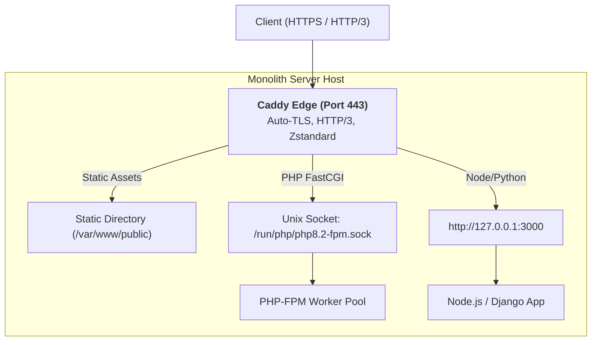

# 04. Caddy: Monolith Deployments

Caddy provides an extraordinarily clean and safe developer experience for monolithic applications. Features that require dozens of lines of delicate regex in Apache or NGINX are reduced to single, robust directives in Caddy.

---

## 1. Monolith Architecture Overview



---

## 2. Production Monolith: PHP-FPM (Laravel / WordPress)

In Caddy, a complete production PHP setup with automatic HTTPS, modern compression, static caching, and front-controller routing requires just **14 lines**:

```caddy
app.company.com {
    # 1. Modern compression
    encode zstd gzip

    # 2. Document root
    root * /var/www/app/public

    # 3. PHP-FPM integration (handles try_files, fastcgi_params automatically)
    php_fastcgi unix//run/php/php8.2-fpm.sock

    # 4. Serve static assets
    file_server

    # 5. Security: Deny hidden files (.git, .env)
    @hidden path */.*
    error @hidden 404

    # 6. Static asset caching
    @static path *.jpg *.jpeg *.png *.gif *.ico *.css *.js *.woff2 *.webp
    header @static Cache-Control "public, max-age=31536000, immutable"
}
```

---

## 3. Node.js / Python Monolith with SPA Fallback

```caddy
node.company.com {
    encode zstd gzip

    # 1. Serve static assets from /static
    handle /static/* {
        root * /var/www/app/static
        file_server
    }

    # 2. SPA Front-End (React / Vue)
    handle /app/* {
        root * /var/www/app/dist
        try_files {path} /app/index.html
        file_server
    }

    # 3. Reverse Proxy API & Dynamic Requests
    handle {
        reverse_proxy 127.0.0.1:3000 {
            header_up X-Real-IP {remote_host}
        }
    }
}
```
