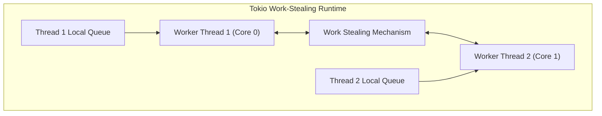

# 03. Ferron: Architecture & KDL Configuration

Deep dive into Ferron’s Rust Tokio concurrency architecture, zero-cost abstractions, and the KDL (KDL Document Language) syntax used to define server behavior.

---

## 1. Concurrency Model: Tokio Work-Stealing Runtime

Ferron is powered by **Tokio**, the industry standard asynchronous runtime in Rust:
* **Multi-Threaded Work Stealing**: Tokio spawns worker threads matching the number of physical/logical CPU cores. Each worker maintains its own local run queue of tasks.
* **Work Stealing**: If worker 1 exhausts its local queue, it automatically steals tasks from the queue of worker 2, ensuring 100% CPU utilization without thread contention.
* **Zero-Cost Async Futures**: Rust compiles `async`/`await` code into deterministic state machines. There is zero runtime interpretation or reflection overhead.



---

## 2. KDL Configuration Language Syntax

Ferron uses **KDL (KDL Document Language)**. KDL is a structured, strongly-typed node-based format designed for configuration documents:

```kdl
// /etc/ferron/ferron.kdl

// 1. Global server block
server {
    auto_tls_letsencrypt_production
    workers auto
}

// 2. Virtual host site block
site "company.com" {
    root "/var/www/html"

    // Route blocks define path handlers
    route "/api/*" {
        proxy "http://127.0.0.1:3000" {
            preserve_host true
        }
    }

    route "/*" {
        file_server
        try_files "$uri" "$uri/" "/index.html"
    }
}
```

### KDL Syntax Rules:
* **Nodes & Properties**: A node has a name, followed by arguments (values), properties (`key=value`), and optional children enclosed in `{}`.
* **Comments**: Supports single-line (`//`) and multi-line (`/* */`) comments.
* **Strings & Types**: Strings can be quoted (`"..."`). Booleans (`true`, `false`) and numbers (`80`, `30s`) are native types.
