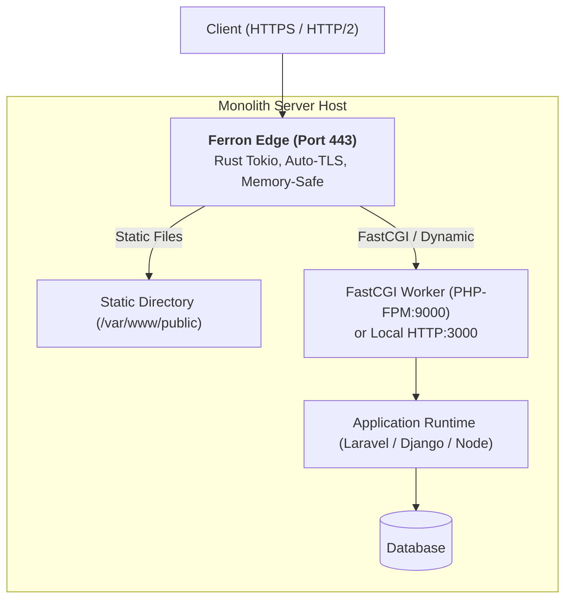

# 04. Ferron: Monolith Deployments

Ferron provides an ultra-low latency, memory-safe frontend for monolithic architectures. Thanks to Rust's zero-cost abstractions, Ferron serves static assets at kernel-saturating speeds while cleanly interfacing with application workers via FastCGI, SCGI, or local reverse proxying.

---

## 1. Monolith Traffic Topology



---

## 2. Production Monolith: PHP-FPM via FastCGI

Ferron includes native support for FastCGI, making it an excellent drop-in replacement for NGINX in PHP-based monoliths:

```kdl
// /etc/ferron/ferron.kdl

server {
    auto_tls_letsencrypt_production
}

site "monolith.company.com" {
    root "/var/www/monolith/public"

    // 1. Static asset caching
    route "/static/*" {
        file_server
        header "Cache-Control" "public, max-age=31536000, immutable"
    }

    // 2. FastCGI processing for PHP files
    route "/*.php" {
        fastcgi "127.0.0.1:9000" {
            index "index.php"
        }
    }

    // 3. SPA / Front-controller fallback (Laravel / Symfony)
    route "/*" {
        try_files "$uri" "$uri/" "/index.php?$query_string"
        fastcgi "127.0.0.1:9000"
    }
}
```

---

## 3. Node.js / Python Monolith Reverse Proxy

```kdl
site "app.company.com" {
    root "/var/www/app/static"

    // Serve static assets directly from disk
    route "/assets/*" {
        file_server
        header "Cache-Control" "public, max-age=86400"
    }

    // Forward all API and dynamic requests to Node.js / Python
    route "/*" {
        proxy "http://127.0.0.1:3000" {
            preserve_host true
            timeout 30s
        }
    }
}
```
