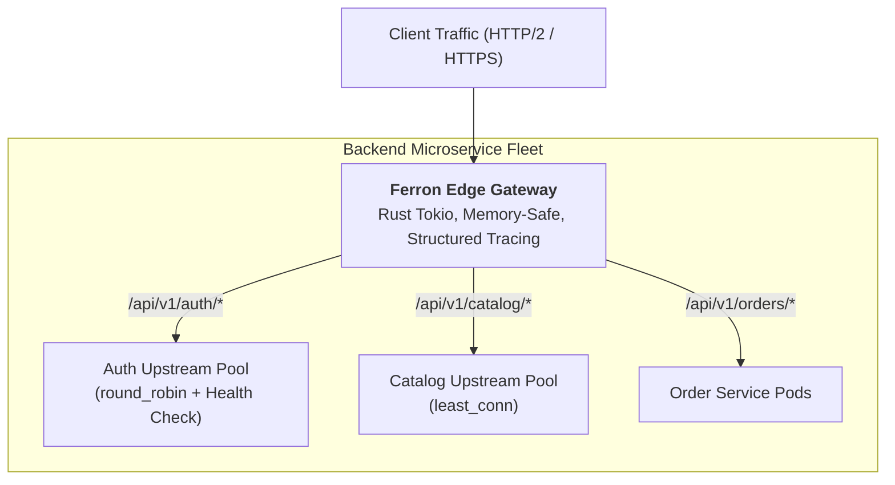

# 05. Ferron: Microservices & Reverse Proxy

In a distributed microservices environment, Ferron operates as a secure, memory-safe Edge Proxy and Layer 7 router. Built with Rust's high-efficiency concurrency, it handles heavy reverse proxy workloads with minimal memory consumption and predictable, microsecond-level latency.

---

## 1. Microservices Gateway Topology



---

## 2. Production API Gateway Configuration in KDL

```kdl
// /etc/ferron/ferron.kdl

// 1. Define Upstream Load Balancing Pools
upstream "auth_pool" {
    server "10.0.1.10:8080"
    server "10.0.1.11:8080"
    policy "least_conn"
    health_check "/healthz" 5s
}

upstream "catalog_pool" {
    server "10.0.2.10:8080" weight=3
    server "10.0.2.11:8080" weight=1
    policy "round_robin"
    health_check "/healthz" 10s
}

// 2. Gateway Site Configuration
site "api.company.com" {
    
    // Inject Distributed Tracing & Security Headers
    header "Strict-Transport-Security" "max-age=31536000; includeSubDomains"
    header "X-Content-Type-Options" "nosniff"
    header "X-Frame-Options" "DENY"

    // Route 1: Authentication Microservice
    route "/api/v1/auth/*" {
        proxy "upstream://auth_pool" {
            preserve_host true
            timeout 5s
        }
    }

    // Route 2: Product Catalog Microservice
    route "/api/v1/catalog/*" {
        proxy "upstream://catalog_pool" {
            preserve_host true
            timeout 10s
        }
    }

    // Route 3: Orders Microservice
    route "/api/v1/orders/*" {
        proxy "http://10.0.3.10:8080" {
            preserve_host true
            timeout 15s
        }
    }

    // Health Check endpoint for cloud load balancer
    route "/healthz" {
        respond "OK" 200
    }
}
```

---

## 3. Production Observability & Structured Tracing

Ferron has built-in support for structured logging and distributed tracing. Because it is written in Rust using the `tracing` ecosystem, you can emit high-resolution JSON logs directly into vector collectors (Datadog, Loki, OpenTelemetry):

```kdl
server {
    log {
        format "json"
        level "info"
        destination "stdout"
    }
}
```
