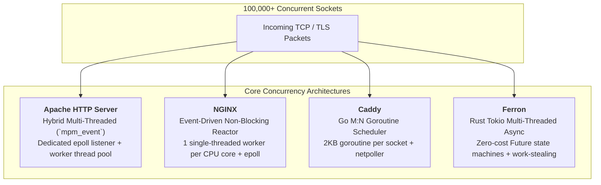

# 01. Server Comparison: Apache vs. NGINX vs. Caddy vs. Ferron

A side-by-side technical comparison of the four major web servers across concurrency models, resource efficiency, memory safety, and workload capabilities.

---

## 1. Concurrency & I/O Engine Comparison

| Dimension | Apache (MPM Event) | NGINX | Caddy | Ferron |
| :--- | :--- | :--- | :--- | :--- |
| **Language** | C | C | Go | Rust |
| **Concurrency Primitive** | OS Threads | Single-threaded Event Loop | Go Goroutines | Rust Async Futures (Tokio) |
| **I/O Multiplexing** | `epoll` / `kqueue` | `epoll` / `kqueue` | Go Netpoller (`epoll`) | Tokio Reactor (`epoll`) |
| **RAM per 10k Conns** | ~150MB – 400MB | ~25MB – 50MB | ~80MB – 180MB | ~25MB – 60MB |
| **Garbage Collector?** | No | No | Yes (Go GC) | No |
| **CPU Context Switching** | Medium | Very Low (Core Affinity) | Low | Very Low |
| **Memory Safety** | Manual (Unsafe) | Manual (Unsafe) | Managed (Safe) | Compile-time (Safe) |
| **Vulnerability Risk** | Buffer overflows, UAF | Buffer overflows, UAF | Immune to memory corruption | Immune to memory corruption |

---

## 2. Monolith Workload Comparison

How each web server serves monolithic architectures (e.g., PHP-FPM, Python WSGI/ASGI, Node.js, Ruby Puma):

| Capability | Apache | NGINX | Caddy | Ferron |
| :--- | :--- | :--- | :--- | :--- |
| **Static File Offloading** | `mod_mime` + `mod_expires` | Zero-copy `sendfile` | Built-in `file_server` | Built-in `file_server` |
| **Front Controller (SPA)** | `RewriteRule` (.htaccess) | `try_files $uri /index.php` | `try_files {path} /index.php` | `try_files "$uri" "/index.php"` |
| **PHP-FPM Integration** | `mod_proxy_fcgi` | `fastcgi_pass unix:...` | Single-line `php_fastcgi` | Native `fastcgi` block |
| **Local App Proxy** | `ProxyPass unix:...` | `proxy_pass http://unix:...`| `reverse_proxy unix/...` | `proxy "http://..."` |
| **Edge Microcaching** | Complex (`mod_cache`) | Native `proxy_cache` | Plugin required | Built-in caching |
| **Dynamic Compression** | `mod_deflate` (Gzip) | `gzip on;` | Native `zstd` & `gzip` | Native `gzip` |

---

## 3. Microservices Workload Comparison

How each web server operates as an Edge API Gateway or Ingress Controller:

| Gateway Capability | Apache | NGINX | Caddy | Ferron |
| :--- | :--- | :--- | :--- | :--- |
| **Ingress Path Routing** | `ProxyPass /path` | `location /path` | Named matchers (`@path`) | `route "/path/*"` |
| **Load Balancing** | `mod_proxy_balancer` | `upstream` block | `reverse_proxy` list | `upstream` block |
| **Active Health Checks** | `mod_proxy_hcheck` | NGINX Plus / Module | Built-in native | Built-in native |
| **Rate Limiting** | `mod_ratelimit` | `limit_req_zone` (Leaky bucket)| Plugin (`rate-limit`) | Native config |
| **Distributed Tracing** | `RequestHeader set X-Request-ID` | `add_header X-Request-ID $request_id` | `header X-Request-ID {http.request.uuid}` | Native structured tracing |
| **WebSocket Proxying** | `mod_proxy_wstunnel` | `map $http_upgrade` | Automatic | Automatic |
| **gRPC Multiplexing** | Limited | Native `grpc_pass` | Native `h2c` | Native |
| **Internal mTLS** | Complex `mod_ssl` | Complex client certs | Native internal CA | Native TLS |

---

## 🔗 Navigation
* **Previous:** [05. Ferron: 06. Practical Examples](../05-ferron/06-practical-examples.md)
* [02. Decision Guide: Which Server Should You Choose?](./02-decision-guide.md)
* [03. Configuration Cheat Sheet (Side-by-Side)](./03-cheat-sheet.md)

