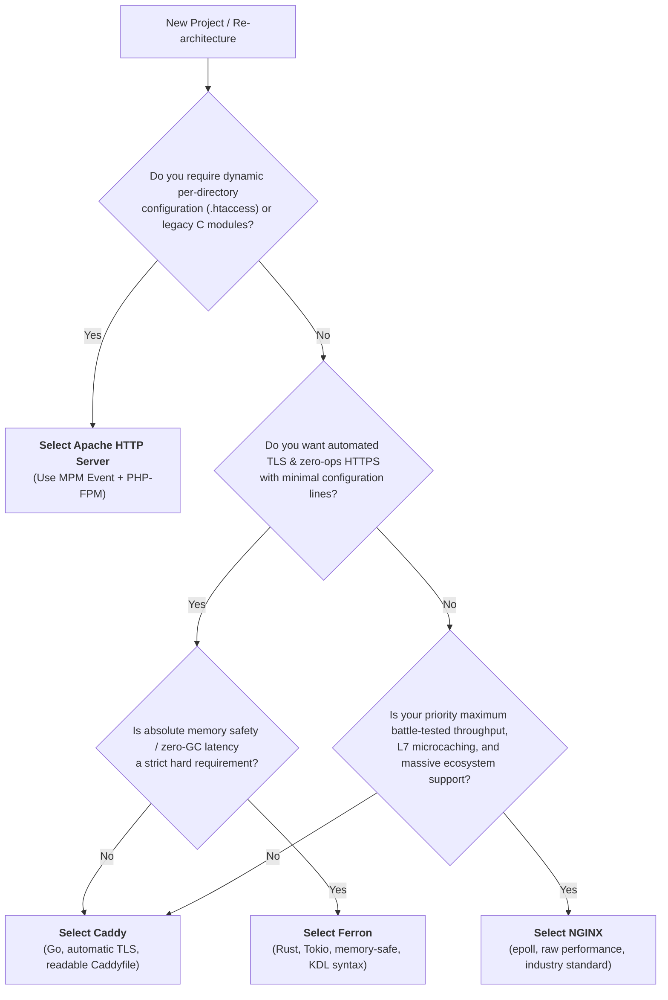

# 02. Decision Guide: Which Web Server Should You Choose?

As a Lead Software Engineer, choosing a web server is an architectural commitment. Use this guide to select the right server based on your team's size, performance targets, and security posture.

---

## 1. Architectural Decision Flowchart

---

## 2. Server Selection by Production Scenario

### Scenario 1: Monolithic Application (PHP, Laravel, WordPress, Django)
* **Primary Recommendation: NGINX**
  * Maximum static asset offload via `sendfile`.
  * High-speed Unix domain socket proxying to PHP-FPM or Gunicorn.
* **Alternative: Caddy**
  * Simplifies SSL provisioning and configuration down to 15 lines of Caddyfile with `php_fastcgi`.

### Scenario 2: High-Throughput Microservices API Gateway
* **Primary Recommendation: NGINX**
  * Unrivaled connection density, deterministic low memory, and battle-tested Kubernetes Ingress controllers (`ingress-nginx`).
  * Advanced microcaching and leaky bucket rate limiting.

### Scenario 3: Cloud-Native & Zero-Ops Stacks
* **Primary Recommendation: Caddy**
  * Automatic HTTPS certificate management (ACME) with zero external dependencies.
  * Dynamic configuration via HTTP REST JSON API (`localhost:2019/load`).
  * Built-in active health checks and circuit breaking.

### Scenario 4: High-Security & Memory-Critical Edge (IoT, FinTech, Defense)
* **Primary Recommendation: Ferron**
  * Written in **Rust**: Immune to memory corruption, buffer overflows, and use-after-free vulnerabilities.
  * Zero garbage collection pauses and <10MB baseline RAM footprint.
  * Modern, strongly-typed KDL configuration.

### Scenario 5: Legacy Multi-Tenant & Shared Hosting
* **Primary Recommendation: Apache HTTP Server**
  * Decentralized per-directory configuration via `.htaccess` allows developers to modify rewrites and auth without root server access.

---

## 3. Quick Decision Checklist

| Priority | Winner |
| :--- | :--- |
| **Easiest SSL & Modern Defaults** | **Caddy** |
| **Highest Raw Throughput & Ecosystem** | **NGINX** |
| **Strongest Memory Safety & Security** | **Ferron** |
| **Best for Legacy / `.htaccess`** | **Apache** |
| **Lowest RAM Usage** | **NGINX / Ferron** (<10MB) |
| **Dynamic API Reconfiguration** | **Caddy** (REST JSON API) |

---

## 🔗 Next Steps
* [01. Server Comparison: Apache vs. NGINX vs. Caddy vs. Ferron](./01-server-comparison.md)
* [03. Configuration Cheat Sheet (Side-by-Side)](./03-cheat-sheet.md)
