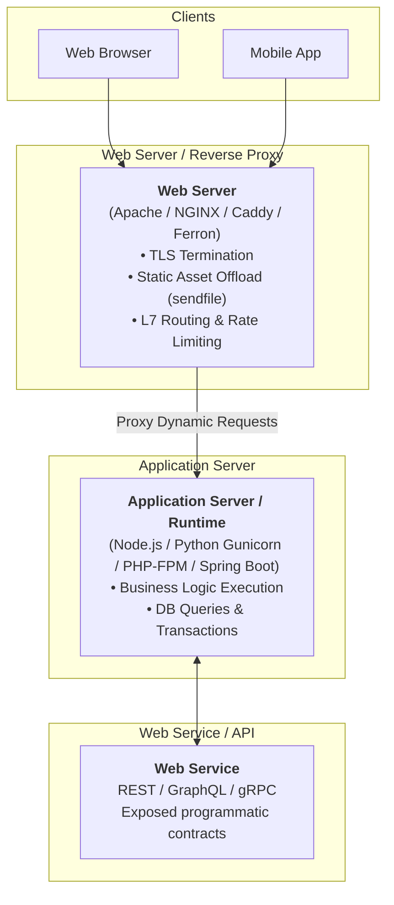

# 01. What is a Web Server?

In software engineering, the term **"Web Server"** is often conflated with application runtimes, APIs, and cloud services. As a lead engineer, clarifying these architectural boundaries is foundational to designing reliable systems.

---

## 1. Defining the Core Concepts

### The 4 Crucial Definitions:

1. **Web Server (Software)**:
   * A program that speaks the **HTTP/HTTPS** protocol (RFC 9110/9112/9113/9114).
   * Its primary responsibility is **transport-level efficiency**: accepting network sockets, negotiating TLS, serving static files directly from the filesystem, and routing requests to upstream processes.
   * *Examples:* NGINX, Apache HTTP Server, Caddy, Ferron.

2. **Application Server (Runtime)**:
   * A program designed to execute dynamic business logic in a programming language (Node.js, Python, Java, PHP, Ruby, Go).
   * It handles database connections, user sessions, data validation, and business workflows.
   * *Examples:* Gunicorn, uWSGI, PHP-FPM, Puma, Tomcat, Node.js HTTP runtime.

3. **Web Service**:
   * A standardized API interface (REST, SOAP, GraphQL, gRPC) exposed over HTTP for machine-to-machine communication.
   * A web service runs *inside* an application server and is typically fronted by a web server.

4. **Reverse Proxy & API Gateway**:
   * A web server configured to sit between clients and backend servers to provide load balancing, SSL offloading, rate limiting, and centralized security.

---

## 2. Core Responsibilities of a Modern Web Server

| Responsibility | How the Web Server Handles It | Why App Runtimes Fail at It |
| :--- | :--- | :--- |
| **TLS Termination** | Hardware-accelerated OpenSSL/Rustls with session resumption and OCSP stapling | High CPU and garbage collection overhead in Node/Python/Ruby |
| **Static File Delivery** | Zero-copy `sendfile` direct from kernel page cache to NIC | Reads file into application memory, blocking event loops |
| **Slowloris Defense** | Buffers complete HTTP requests in tiny kernel buffers before dispatching | Ties up expensive application threads/workers (50MB+ each) |
| **Virtual Hosting** | Routes traffic by `Host` or SNI header across multiple domains | Requires separate processes or complex application-level routing |
| **Compression** | Hardware-efficient Gzip, Brotli, and Zstandard streaming | Adds substantial latency to dynamic language execution |

---

## 3. Why Never Expose App Runtimes Directly to the Internet

Exposing Node.js (`app.listen(3000)`), Python Flask/Django, or Spring Boot directly to the public internet introduces critical vulnerabilities:

1. **Thread/Worker Starvation**: A slow client sending 1 byte every 10 seconds will tie up an entire application thread. 100 slow connections can paralyze an entire multi-core backend.
2. **Denial of Service (DoS)**: Web servers enforce strict request limits (`client_max_body_size`, header timeouts) at the socket level before any memory is allocated.
3. **Privilege Isolation**: Web servers bind to privileged ports (`80`, `443`) as `root`, then immediately drop privileges to unprivileged users (`nginx`, `www-data`), keeping the application process isolated.
