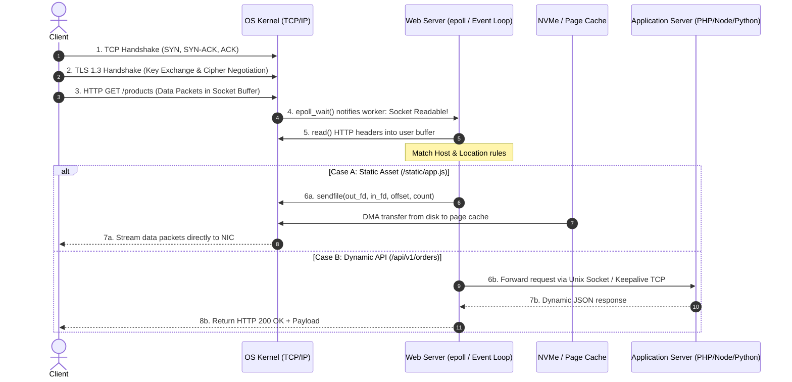
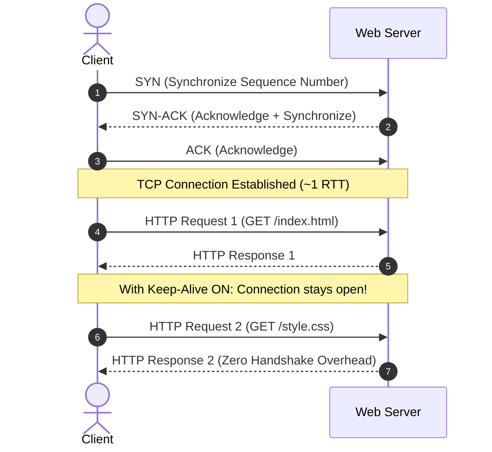

# 02. How Web Servers Work: The Request Lifecycle

To troubleshoot complex production latency and connection issues, you must understand what happens beneath the surface when a client requests a URL.

---

## 1. End-to-End Request Lifecycle



---

## 2. The Socket Layer & File Descriptors

Under Linux, **everything is a file**. When a web server starts:
1. It executes `socket()` to create a network file descriptor.
2. It executes `bind()` to associate the socket with an IP and Port (e.g., `0.0.0.0:443`).
3. It executes `listen()` with a backlog queue (e.g., `somaxconn = 65535`).
4. Incoming connections are placed in the kernel's SYN backlog until the handshake completes, after which they move to the accept queue.

### Why `worker_rlimit_nofile` Matters:
Each open client connection, backend upstream socket, and open static file consumes **one file descriptor**.
If an NGINX worker has a limit of `1024` file descriptors (`ulimit -n`), it cannot handle more than ~500 concurrent connections. Production web servers must set:
```nginx
worker_rlimit_nofile 65535;
```

---

## 3. The TCP 3-Way Handshake & Keep-Alive



Without **Keep-Alive**, the client and server must execute a new TCP handshake and TLS negotiation for every image, script, and API call, destroying throughput.
