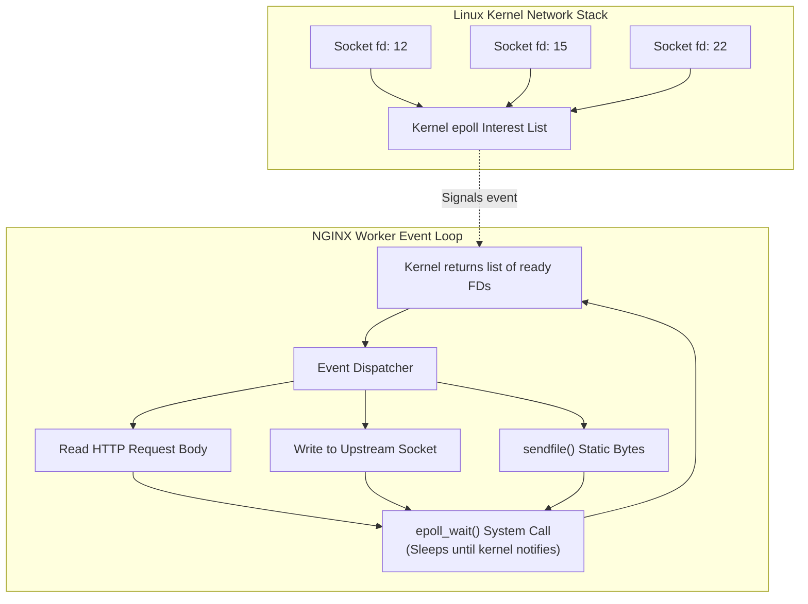

# 02. NGINX: What, Why & How

NGINX powers over 30% of the world's busiest websites. Understanding its architecture and operational model is a core competency for any infrastructure or lead engineer.

---

## 1. What is NGINX?

Created in 2004 by Russian software engineer **Igor Sysoev** to solve the **C10K problem** (handling 10,000 concurrent client connections on a single server), NGINX is an open-source, high-performance HTTP web server, reverse proxy, and Layer 4/7 load balancer written in **C**.

Unlike traditional process-per-connection servers, NGINX uses an **event-driven, asynchronous, non-blocking reactor architecture**.

---

## 2. Why Use NGINX? (The Strengths)

1. **Extreme Concurrency with Minimal Memory**:
   * A single NGINX worker process can handle tens of thousands of simultaneous sockets while consuming only ~2.5KB of memory per idle connection.
2. **Deterministic Performance**:
   * Zero-copy static file streaming (`sendfile`) transfers data directly from the kernel page cache to the network card without CPU user-space copying.
3. **Advanced Edge Capabilities**:
   * Built-in microcaching, rate limiting (leaky bucket), connection limiting, upstream keepalive pooling, and HTTP/2 / HTTP/3 termination.
4. **Ecosystem & Cloud Adoption**:
   * The undisputed standard for Kubernetes Ingress controllers (`ingress-nginx`), AWS/GCP reverse proxies, and edge CDNs (Cloudflare was originally built on NGINX).

---

## 3. Why NOT Use NGINX? (The Weaknesses)

1. **Manual TLS Management**:
   * Unlike Caddy and Ferron, NGINX does not have built-in ACME/Let's Encrypt certificate issuance. You must manage external cron jobs (Certbot).
2. **C Memory Safety**:
   * Being written in C, it is susceptible to memory safety issues (e.g., buffer overflows, pointer corruption) if custom C modules are used.
3. **Static File Reloads**:
   * Modifying upstreams or routes requires writing configuration files to disk and signaling the process (`nginx -s reload`). It lacks an out-of-the-box REST API for dynamic reconfiguration (unless using NGINX Plus).

---

## 4. How NGINX Works: The Event Loop & Reactor

Instead of dedicating an entire OS thread to wait for data on a socket, the NGINX worker registers all sockets with the kernel via `epoll`. The worker sleeps until the kernel wakes it up with a list of ready sockets, processes them instantaneously, and returns to waiting.
