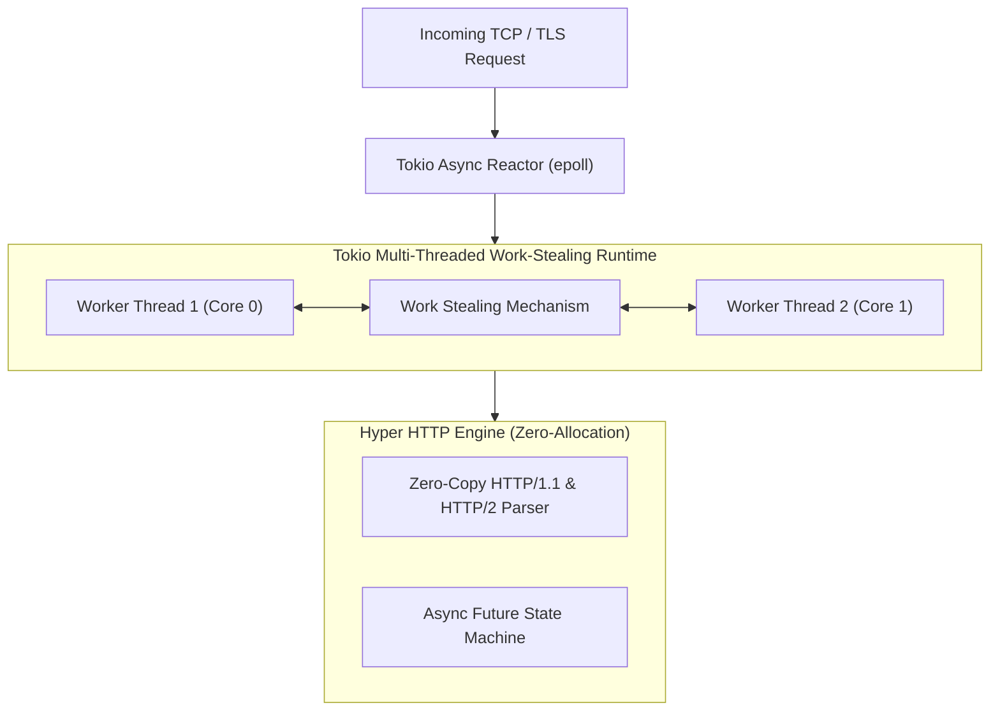

# 02. Ferron: What, Why & How

Ferron brings modern systems programming principles to the web server domain. By combining Rust's compile-time safety guarantees with Tokio's async concurrency, it establishes a new benchmark for secure, low-latency edge serving.

---

## 1. What is Ferron?

**Ferron** (formerly Project Karpacz) is an open-source, high-performance web server, reverse proxy, and static file server written in **Rust**.

It was built from the ground up to solve the fundamental trade-off of traditional web servers: **the choice between the raw speed of C (NGINX/Apache) and the memory safety of managed languages (Caddy/Go)**. In Ferron, you get both.

---

## 2. Why Use Ferron? (The Strengths)

1. **Compile-Time Memory Safety**:
   * Rust's ownership model and borrow checker eliminate buffer overflows, use-after-free, dangling pointers, and data races at compile time.
   * Eliminates ~70% of historical CVEs that affect C-based web servers.
2. **Zero Garbage Collection Overhead**:
   * Unlike Go-based servers (Caddy), Rust uses deterministic RAII (Resource Acquisition Is Initialization). There are **no GC pauses** and no unpredictable memory spikes under heavy load.
3. **Ultra-Low Memory Footprint**:
   * Consumes <10MB RAM at baseline, comparable to NGINX and significantly leaner than Apache or Caddy.
4. **Modern KDL Configuration**:
   * Uses **KDL (KDL Document Language)**—a structured, strongly-typed node-based format that is cleaner than XML/JSON/YAML.
5. **Automatic TLS**:
   * Native Let's Encrypt certificate issuance and renewals powered by Rustls (a memory-safe TLS library).

---

## 3. Why NOT Use Ferron? (The Weaknesses)

1. **Younger Ecosystem**:
   * While rapidly maturing, Ferron does not yet have the 20-year catalog of specialized third-party modules found in NGINX or Apache.
2. **Community Size**:
   * Smaller community and fewer third-party integrations compared to industry titans like NGINX.

---

## 4. How Ferron Works: Tokio & Hyper

Requests are handled as asynchronous Rust `Future` state machines executed across a multi-threaded work-stealing pool. Socket reads and writes are non-blocking and zero-allocation wherever possible.
