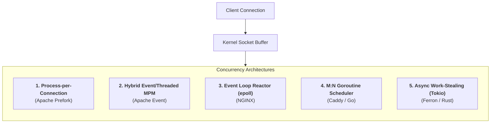

# 01. Concurrency & I/O Models

To design robust architectures, you must understand how your web server interacts with the Linux kernel, CPU registers, and network sockets under heavy load. The difference between handling 1,000 requests per second and 100,000 requests per second boils down to the **underlying concurrency and I/O architecture**.

---

## 1. The Core Concurrency Models

---

## 2. Detailed Architectural Breakdown

### A. Apache HTTP Server: MPM Evolution
* **mpm_prefork:** 1 Process per connection. High memory usage (15MB–50MB per connection). Required only for non-thread-safe C libraries.
* **mpm_worker:** Spawns processes with worker thread pools. Lower RAM, but idle Keep-Alive connections tie up worker threads.
* **mpm_event:** Dedicates a listener thread per process to monitor idle sockets via `epoll`. Only active requests bind to worker threads.

### B. NGINX: Event-Driven Non-Blocking Reactor
* **Architecture:** 1 worker process per CPU core (`worker_processes auto;`).
* **Non-Blocking epoll:** Workers never wait on socket I/O. Sockets register events with `epoll_wait()`.
* **Memory Footprint:** ~2.5KB–4KB per idle connection.

### C. Caddy: Go M:N Goroutine Concurrency
* **Architecture:** Spawns a lightweight goroutine (~2KB initial stack) per request.
* **Work-Stealing Scheduler:** Maps thousands of goroutines onto $N$ OS threads with non-blocking network poller.
* **Trade-off:** Minimal GC pauses under heavy memory pressure; baseline RAM ~30MB–60MB.

### D. Ferron: Rust Async & Tokio Work-Stealing
* **Architecture:** Zero-cost `Future` state machines compiled directly into binary.
* **Tokio Runtime:** Multi-threaded work-stealing executor.
* **Memory Safety:** Compile-time borrow checker eliminates buffer overflows and race conditions without a garbage collector.

---

## 3. Concurrency Comparison Matrix

| Metric | Apache (MPM Event) | NGINX | Caddy | Ferron |
| :--- | :--- | :--- | :--- | :--- |
| **Concurrency Primitive** | OS Threads | Single-threaded Event Loop | Go Goroutines | Rust Async Futures (Tokio) |
| **I/O Multiplexing** | `epoll` / `kqueue` | `epoll` / `kqueue` | Go Netpoller (`epoll`) | Tokio Reactor (`epoll`) |
| **Memory per 10k Conns** | ~150MB – 400MB | ~25MB – 50MB | ~80MB – 180MB | ~25MB – 60MB |
| **Garbage Collector?** | No | No | Yes (Go GC) | No |
| **CPU Context Switching** | Medium | Very Low (Core Affinity) | Low | Very Low |
| **Vulnerability Class** | Memory corruption (C) | Memory corruption (C) | Safe (Go memory model) | Safe (Rust borrow checker) |
