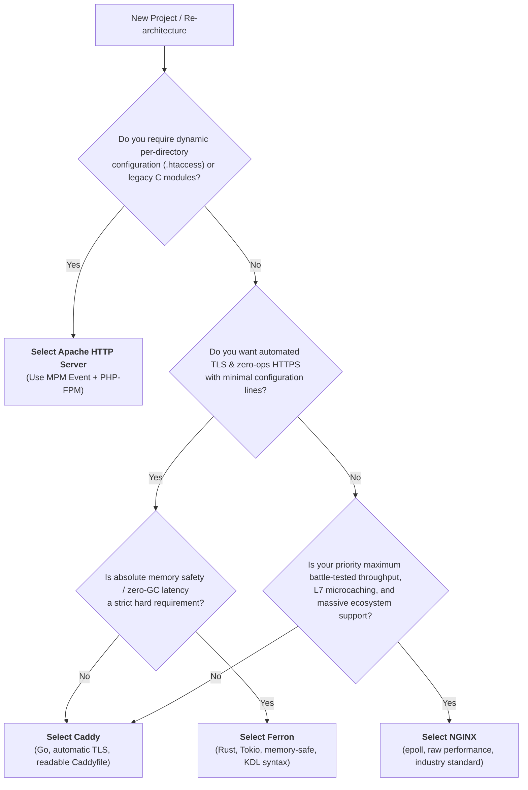

# 02. Decision Matrix: Which Web Server Should You Choose?

As a Lead Software Engineer, choosing a web server is an architectural commitment. You must balance **raw throughput**, **operational simplicity**, **security guarantees**, and **ecosystem maturity**.

---

## 1. Architectural Decision Flowchart

---

## 2. Server Selection by Scenario

| Scenario | Recommended Choice | Rationale |
| :--- | :--- | :--- |
| **Monolith (Laravel, WordPress, Django)** | **NGINX** (or **Caddy**) | NGINX provides optimal Unix socket proxying and static caching. Caddy simplifies SSL and config to 15 lines. |
| **High-Throughput Microservice Gateway** | **NGINX** | Unrivaled connection density, microcaching, and battle-tested Kubernetes Ingress controllers. |
| **Zero-Ops Cloud-Native Stacks** | **Caddy** | Native auto-HTTPS via Let's Encrypt / ZeroSSL, REST JSON API, and concise Caddyfile. |
| **High-Security / Memory-Critical Edge** | **Ferron** | Rust memory safety eliminates buffer overflows and use-after-free CVEs; zero GC pauses. |
| **Legacy Multi-Tenant Hosting** | **Apache** | Decentralized `.htaccess` allows developers to modify routing without root access. |

---

## 3. Comprehensive Trade-off Matrix

| Feature / Metric | Apache HTTP Server | NGINX | Caddy | Ferron |
| :--- | :--- | :--- | :--- | :--- |
| **Throughput & Latency** | ⭐⭐⭐ Good (MPM Event) | ⭐⭐⭐⭐⭐ Industry Benchmark | ⭐⭐⭐⭐ Very Fast | ⭐⭐⭐⭐⭐ Ultra Fast |
| **Memory Footprint** | ⭐⭐ High (Threads/Processes) | ⭐⭐⭐⭐⭐ Ultra Low (<10MB) | ⭐⭐⭐ Moderate (~40MB) | ⭐⭐⭐⭐⭐ Ultra Low (<10MB) |
| **Config Simplicity** | ⭐⭐ Complex & Verbose | ⭐⭐⭐ Declarative, Structured | ⭐⭐⭐⭐⭐ Cleanest (`Caddyfile`) | ⭐⭐⭐⭐ Clean & Modern (`KDL`) |
| **Auto-HTTPS (ACME)** | ⭐ Requires Certbot scripts | ⭐ Requires Certbot scripts | ⭐⭐⭐⭐⭐ Automatic & Native | ⭐⭐⭐⭐⭐ Automatic & Native |
| **Memory Safety** | ❌ Unsafe (C) | ❌ Unsafe (C) | ✅ Safe (Go memory model) | ✅ Safe (Rust Borrow Checker) |
| **Ecosystem & Modules** | ⭐⭐⭐⭐⭐ Vast | ⭐⭐⭐⭐⭐ Massive | ⭐⭐⭐⭐ Growing (Go plugins) | ⭐⭐ Emerging |
| **Zero-Downtime Reloads** | ✅ Yes (`apachectl graceful`) | ✅ Yes (`nginx -s reload`) | ✅ Yes (JSON API & Signals) | ✅ Yes |
| **Dynamic Configuration** | ❌ Requires file rewrite | ❌ Requires file rewrite | ✅ Full REST JSON API | ❌ File reload |
