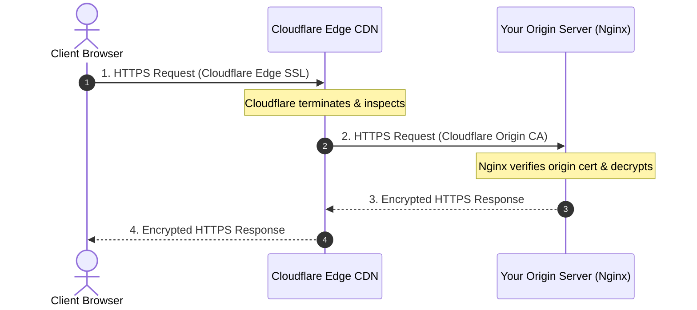

# HTTPS & SSL/TLS Configuration

Configuring secure HTTPS with **Let's Encrypt (Certbot)** and **Cloudflare Full (Strict)** SSL.

---

## Why HTTPS?

HTTPS encrypts communication between the client's browser and your Nginx web server using TLS (Transport Layer Security). This ensures:
- **Confidentiality:** Eavesdroppers cannot inspect passwords, cookies, or data in transit.
- **Integrity:** Man-in-the-middle attacks cannot tamper with or inject ads into responses.
- **Authentication:** Browsers verify that the server is genuine and trusted by a Certificate Authority (CA).

---

## Option 1: Let's Encrypt (Certbot) — Automated Free SSL

Let's Encrypt is the industry standard for free, automated SSL certificates.

### 1. Install Certbot

```bash
sudo apt update
sudo apt install -y certbot python3-certbot-nginx
```

### 2. Obtain & Install Certificate Automatically

```bash
sudo certbot --nginx -d example.com -d www.example.com
```

Certbot automatically:
1. Validates domain ownership via HTTP-01 challenge.
2. Generates certificates into `/etc/letsencrypt/live/example.com/`.
3. Configures your Nginx server block with SSL directives.
4. Sets up automatic certificate renewal via a systemd timer.

### 3. Verify Auto-Renewal

```bash
sudo certbot renew --dry-run
```

---

## Option 2: Cloudflare Full (Strict) Mode

When using Cloudflare's CDN and reverse proxy, traffic follows this path:



In **Full (Strict)** mode, Cloudflare verifies that your origin server presents a valid certificate signed by Cloudflare Origin CA or a trusted public CA.

### Step 1: Create Origin Certificate in Cloudflare

1. Open Cloudflare Dashboard → **SSL/TLS** → **Origin Server** → **Create Certificate**.
2. Key Type: **RSA (2048)** or **ECDSA**.
3. Hostnames: `example.com`, `*.example.com`.
4. Validity: **15 years**.
5. Save the generated **Certificate** to `/etc/ssl/example.com/origin.crt`.
6. Save the **Private Key** to `/etc/ssl/example.com/origin.key`.

### Step 2: Secure Certificate Permissions

```bash
sudo mkdir -p /etc/ssl/example.com
# Paste contents into origin.crt and origin.key
sudo chmod 644 /etc/ssl/example.com/origin.crt
sudo chmod 600 /etc/ssl/example.com/origin.key
```

### Step 3: Nginx Production HTTPS Block

```nginx
# Redirect all HTTP traffic to HTTPS
server {
    listen 80;
    listen [::]:80;
    server_name example.com www.example.com;

    return 301 https://$host$request_uri;
}

# HTTPS Server Block
server {
    listen 443 ssl;
    listen [::]:443 ssl;
    http2 on; # Enable HTTP/2 for modern speed
    server_name example.com www.example.com;

    # SSL Certificates
    ssl_certificate /etc/ssl/example.com/origin.crt;
    ssl_certificate_key /etc/ssl/example.com/origin.key;

    # Modern TLS Protocols & Ciphers
    ssl_protocols TLSv1.2 TLSv1.3;
    ssl_ciphers ECDHE-ECDSA-AES128-GCM-SHA256:ECDHE-RSA-AES128-GCM-SHA256:ECDHE-ECDSA-AES256-GCM-SHA384:ECDHE-RSA-AES256-GCM-SHA384:DHE-RSA-AES128-GCM-SHA256:DHE-RSA-AES256-GCM-SHA384;
    ssl_prefer_server_ciphers off;

    # SSL Session Caching for Performance
    ssl_session_cache shared:SSL:10m;
    ssl_session_timeout 1d;
    ssl_session_tickets off;

    root /var/www/example.com;
    index index.html;

    location / {
        try_files $uri $uri/ =404;
    }
}
```

Test and reload:

```bash
sudo nginx -t
sudo systemctl reload nginx
```

---

[Next: Key Features & Performance →](./05-features.md)
