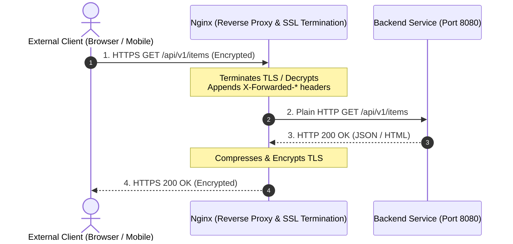

# Reverse Proxy Setup & SSL Termination

A **reverse proxy** sits between external clients and backend application servers, accepting client requests and forwarding them to the appropriate upstream application.

---

## How Reverse Proxying Works



---

## Production Reverse Proxy Configuration

Create `/etc/nginx/sites-available/example.com`:

```nginx
# 1. Upstream definition with Keepalive connection pooling
upstream backend_app {
    server 127.0.0.1:8080;
    keepalive 32; # Keep up to 32 idle connections open to upstream
}

# 2. HTTP to HTTPS redirect
server {
    listen 80;
    listen [::]:80;
    server_name example.com www.example.com;

    return 301 https://$host$request_uri;
}

# 3. Main HTTPS Server Block
server {
    listen 443 ssl;
    listen [::]:443 ssl;
    http2 on;
    server_name example.com www.example.com;

    # SSL Certificates
    ssl_certificate /etc/letsencrypt/live/example.com/fullchain.pem;
    ssl_certificate_key /etc/letsencrypt/live/example.com/privkey.pem;

    # TLS Security
    ssl_protocols TLSv1.2 TLSv1.3;
    ssl_ciphers HIGH:!aNULL:!MD5;
    ssl_prefer_server_ciphers off;

    # Reverse Proxy Location
    location / {
        proxy_pass http://backend_app;

        # HTTP/1.1 required for keepalive connections
        proxy_http_version 1.1;
        proxy_set_header Connection "";

        # Preserve client request information
        proxy_set_header Host $host;
        proxy_set_header X-Real-IP $remote_addr;
        proxy_set_header X-Forwarded-For $proxy_add_x_forwarded_for;
        proxy_set_header X-Forwarded-Proto $scheme;
        proxy_set_header X-Forwarded-Host $host;
        proxy_set_header X-Forwarded-Port $server_port;

        # Timeouts
        proxy_connect_timeout 60s;
        proxy_send_timeout 60s;
        proxy_read_timeout 60s;

        # Proxy Buffering
        proxy_buffering on;
        proxy_buffer_size 16k;
        proxy_buffers 4 64k;
        proxy_busy_buffers_size 128k;
    }
}
```

---

## Breakdown of Key Directives

| Directive | Purpose |
|:---|:---|
| `proxy_pass http://backend_app;` | Forwards the request to the upstream group or address. |
| `proxy_http_version 1.1;` | Uses HTTP/1.1 for upstream communication (required for persistent keepalive). |
| `proxy_set_header Connection "";` | Clears the `Connection: close` header to allow upstream connection reuse. |
| `proxy_set_header Host $host;` | Passes the original `Host` header sent by the client. |
| `proxy_set_header X-Real-IP $remote_addr;` | Passes the client's actual IP address to the backend. |
| `proxy_set_header X-Forwarded-For $proxy_add_x_forwarded_for;` | Appends client IP to any existing proxy list. |
| `proxy_set_header X-Forwarded-Proto $scheme;` | Informs backend whether user connected via `http` or `https`. |

---

## Testing and Activation

```bash
# Enable site
sudo ln -s /etc/nginx/sites-available/example.com /etc/nginx/sites-enabled/

# Test syntax
sudo nginx -t

# Reload gracefully
sudo systemctl reload nginx
```

---

[Next: Configuration Reference →](./07-config.md)
