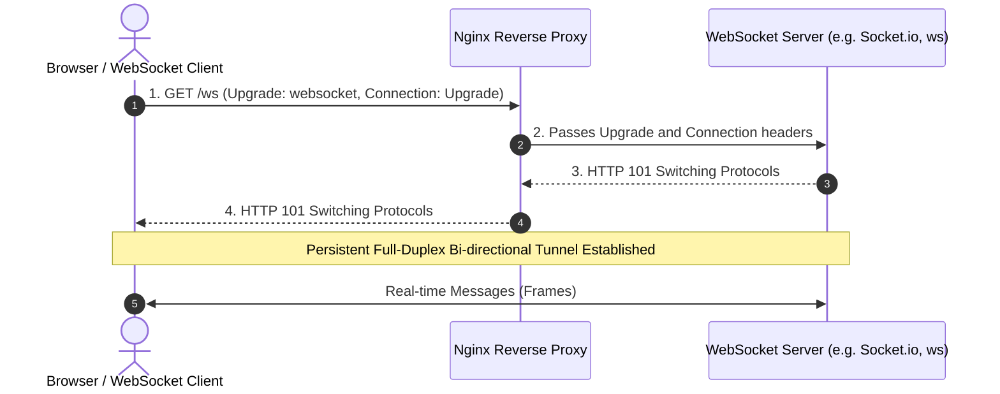

# WebSocket Reverse Proxying

WebSockets provide full-duplex, persistent communication channels over a single TCP connection. Configuring Nginx as a reverse proxy for WebSockets requires specific connection upgrade headers and timeout adjustments.

---

## The WebSocket Handshake

Unlike standard stateless HTTP requests, WebSockets begin with an HTTP `GET` request featuring an `Upgrade: websocket` header. If the server agrees, it responds with `HTTP/1.1 101 Switching Protocols`, and the TCP connection transforms into a bidirectional tunnel.



---

## Nginx Configuration

### 1. Define the `$connection_upgrade` Map

In your `http` block (or inside `/etc/nginx/nginx.conf`):

```nginx
# Maps the Upgrade header to determine if Connection should be 'upgrade' or 'close'
map $http_upgrade $connection_upgrade {
    default upgrade;
    ''      close;
}
```

This ensures that standard HTTP requests without an `Upgrade` header do not receive an erroneous `Connection: upgrade` header.

### 2. Configure the Server & Location Block

```nginx
upstream websocket_backend {
    server 127.0.0.1:3000;
    keepalive 32;
}

server {
    listen 443 ssl;
    server_name ws.example.com;

    ssl_certificate /etc/letsencrypt/live/ws.example.com/fullchain.pem;
    ssl_certificate_key /etc/letsencrypt/live/ws.example.com/privkey.pem;

    location /ws/ {
        proxy_pass http://websocket_backend;

        # WebSocket requires HTTP/1.1
        proxy_http_version 1.1;

        # Upgrade headers
        proxy_set_header Upgrade $http_upgrade;
        proxy_set_header Connection $connection_upgrade;

        # Host and Client IP preservation
        proxy_set_header Host $host;
        proxy_set_header X-Real-IP $remote_addr;
        proxy_set_header X-Forwarded-For $proxy_add_x_forwarded_for;
        proxy_set_header X-Forwarded-Proto $scheme;

        # Timeout settings: Prevent Nginx from terminating idle connections
        # Default is 60s; increase for long-lived socket connections
        proxy_read_timeout 3600s;
        proxy_send_timeout 3600s;
    }
}
```

---

## Critical Caveat: `proxy_read_timeout`

By default, Nginx closes any upstream connection if no data is received within **60 seconds** (`proxy_read_timeout 60s;`).

For WebSockets, you must either:
1. Increase `proxy_read_timeout` (e.g. `3600s` or 1 hour).
2. Implement **heartbeat / ping-pong frames** in your application (e.g. ping every 30 seconds) to keep the connection active.

---

[Next: Microservices API Gateway →](../production-architecture/08-microservice.md)
