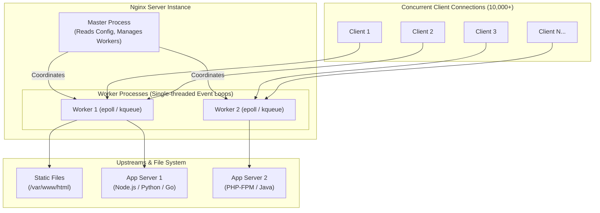
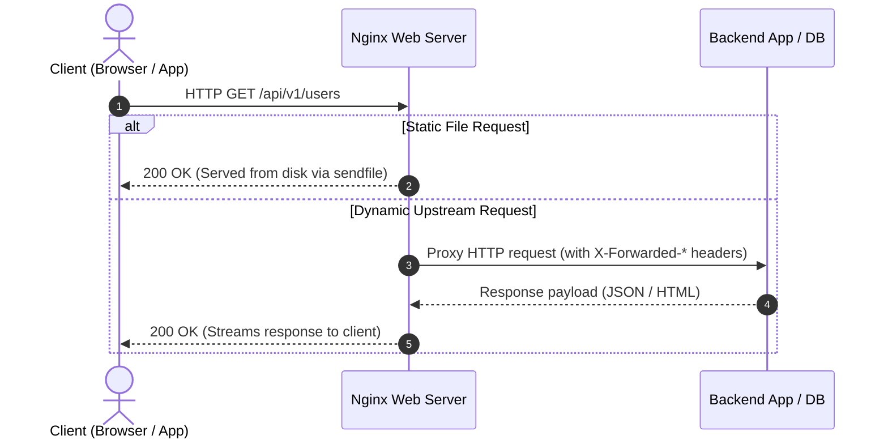

# Introduction to Nginx

**Nginx** (pronounced *"engine-x"*) is a **high-performance web server** that also functions as a **reverse proxy**, **load balancer**, and **HTTP cache**.

> Nginx handles and serves web traffic — it delivers websites, APIs, and web resources efficiently with minimal memory footprint.

---

## History of Nginx

- **Created by:** Igor Sysoev
- **Year:** 2004
- **Origin:** Russia
- **Reason:** To solve the **C10k problem** — handling **10,000+ concurrent connections** on a single server without exhausting system memory.

At the time, traditional web servers (like **Apache HTTP Server**) relied heavily on a *process-per-connection* or *thread-per-connection* model. Under high traffic, thousands of concurrent threads overwhelmed the kernel's scheduler and consumed gigabytes of RAM.

Nginx revolutionized web serving by using an **asynchronous, non-blocking, event-driven architecture**. Today, Nginx powers over **30% of all websites globally**, including Netflix, Cloudflare, Airbnb, and GitHub.

---

## Architecture: How Nginx Achieves Scale

Instead of spawning a new process or thread for every incoming HTTP connection, Nginx runs a small number of **worker processes** (typically one per CPU core) bound to a non-blocking event loop using OS primitives like `epoll` (Linux) or `kqueue` (FreeBSD/macOS).



Each worker can handle thousands of concurrent requests simultaneously with predictable, constant memory usage (~2–5 MB per worker).

---

## Why Nginx?

| Feature | Description |
|:---|:---|
| **High Concurrency** | Handles 10,000+ simultaneous requests per second with negligible CPU and RAM overhead. |
| **Event-Driven Non-blocking I/O** | Single-threaded workers process multiple connections asynchronously using multiplexing (`epoll`/`kqueue`). |
| **Versatile Reverse Proxy** | Seamlessly forwards traffic to upstream applications (Node.js, Python, Go, PHP, Java, .NET). |
| **Intelligent Load Balancing** | Distributes requests across backend servers using Round Robin, Least Connections, IP Hash, and health checks. |
| **SSL/TLS Termination** | Offloads cryptographic handshakes and TLS processing from backend application servers. |
| **Static Asset Performance** | Leverages `sendfile` and `tcp_nopush` for direct kernel-to-network socket file transfers. |
| **Modular & Extensible** | Rich ecosystem of modules (Lua, Brotli, ModSecurity, GeoIP, OpenResty). |

---

## How Nginx Works



### Basic Reverse Proxy Example

```nginx
server {
    listen 80;
    server_name example.com;

    location / {
        proxy_pass http://127.0.0.1:3000;
        proxy_set_header Host $host;
        proxy_set_header X-Real-IP $remote_addr;
        proxy_set_header X-Forwarded-For $proxy_add_x_forwarded_for;
        proxy_set_header X-Forwarded-Proto $scheme;
    }
}
```

---

## Nginx vs Apache

| Feature | Apache HTTP Server | Nginx |
|:---|:---|:---|
| **Architecture** | Process-based / Thread-based (`prefork`, `worker`, `event`) | Asynchronous, event-driven |
| **Concurrency Scale** | Thousands of threads required under high load | Thousands of connections per single worker |
| **Static File Delivery** | Slower; involves filesystem lookups & `.htaccess` parsing | Extremely fast; direct kernel `sendfile` |
| **Memory Footprint** | Grows linearly with number of active connections | Constant and predictable under load |
| **Reverse Proxy** | Add-on modules (`mod_proxy`) | Built-in native core functionality |
| **Configuration** | Distributed (`.htaccess` allowed per folder) | Centralized, high-performance configuration files |

---

## Common Use Cases

1. **Static Website & SPA Hosting**: Serving React, Vue, Svelte, or static HTML/CSS/JS with caching headers.
2. **Reverse Proxy for Web Apps**: Terminating external traffic and proxying to Node.js, FastAPI, Django, Go, or Rails.
3. **API Gateway & Microservices**: Routing paths (`/auth/`, `/orders/`, `/catalog/`) to isolated microservices.
4. **Load Balancer**: Distributing load across auto-scaling VM instances or Kubernetes pods.
5. **SSL/TLS Termination**: Handling HTTPS certificates, HSTS, and cipher negotiation at the edge.
6. **Edge Caching & Rate Limiting**: Caching responses to reduce database load and shielding apps from DDoS.

---

[Next: Installation & Setup →](./02-install-setup.md)
