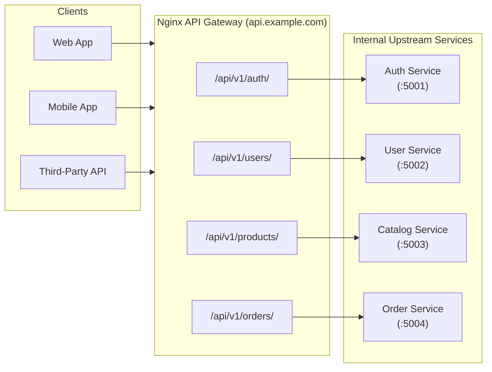

# Microservices API Gateway

Configuring Nginx as an **API Gateway** and reverse proxy for distributed microservice architectures.

---

## The Role of an API Gateway

In a microservices architecture, dozens or hundreds of independent backend services run across different ports, containers, or host machines. An API Gateway acts as the unified front door for external clients:



---

## Production API Gateway Configuration

Create `/etc/nginx/sites-available/api-gateway`:

```nginx
# 1. Upstream clusters with health checks and load balancing
upstream auth_cluster {
    server 10.0.1.10:5001 max_fails=3 fail_timeout=10s;
    server 10.0.1.11:5001 max_fails=3 fail_timeout=10s;
    keepalive 32;
}

upstream user_cluster {
    server 10.0.1.20:5002 max_fails=3 fail_timeout=10s;
    server 10.0.1.21:5002 max_fails=3 fail_timeout=10s;
    keepalive 32;
}

upstream catalog_cluster {
    server 10.0.1.30:5003;
    server 10.0.1.31:5003;
    keepalive 32;
}

# 2. Rate limiting zones
limit_req_zone $binary_remote_addr zone=api_general:10m rate=50r/s;
limit_req_zone $binary_remote_addr zone=auth_limit:10m rate=5r/s;

# 3. Gateway Server Block
server {
    listen 443 ssl;
    listen [::]:443 ssl;
    http2 on;
    server_name api.example.com;

    ssl_certificate /etc/letsencrypt/live/api.example.com/fullchain.pem;
    ssl_certificate_key /etc/letsencrypt/live/api.example.com/privkey.pem;

    # Common Proxy Headers
    proxy_http_version 1.1;
    proxy_set_header Connection "";
    proxy_set_header Host $host;
    proxy_set_header X-Real-IP $remote_addr;
    proxy_set_header X-Forwarded-For $proxy_add_x_forwarded_for;
    proxy_set_header X-Forwarded-Proto $scheme;

    # Failover and timeout handling
    proxy_connect_timeout 5s;
    proxy_send_timeout 15s;
    proxy_read_timeout 15s;
    proxy_next_upstream error timeout http_502 http_503 http_504;

    # Route: Auth Service (Strict Rate Limiting)
    location /api/v1/auth/ {
        limit_req zone=auth_limit burst=10 nodelay;
        proxy_pass http://auth_cluster/;
    }

    # Route: User Service
    location /api/v1/users/ {
        limit_req zone=api_general burst=30 nodelay;
        proxy_pass http://user_cluster/;
    }

    # Route: Catalog Service (with Microcaching)
    location /api/v1/products/ {
        limit_req zone=api_general burst=50 nodelay;
        proxy_pass http://catalog_cluster/;
    }

    # Health check endpoint for external load balancers
    location /healthz {
        access_log off;
        return 200 "healthy\n";
    }
}
```

---

## Important Path-Stripping Rule (`proxy_pass` URI)

Note the trailing slash behavior in `proxy_pass`:

1. **With Trailing Slash:**
   ```nginx
   location /api/v1/users/ {
       proxy_pass http://user_cluster/;
   }
   ```
   A request to `/api/v1/users/profile` is forwarded to `http://user_cluster/profile`. (Nginx strips `/api/v1/users/`).

2. **Without Trailing Slash:**
   ```nginx
   location /api/v1/users/ {
       proxy_pass http://user_cluster;
   }
   ```
   A request to `/api/v1/users/profile` is forwarded to `http://user_cluster/api/v1/users/profile`. (Nginx preserves the full URI).

---

[Next: Security Hardening →](./security-hardening.md)
