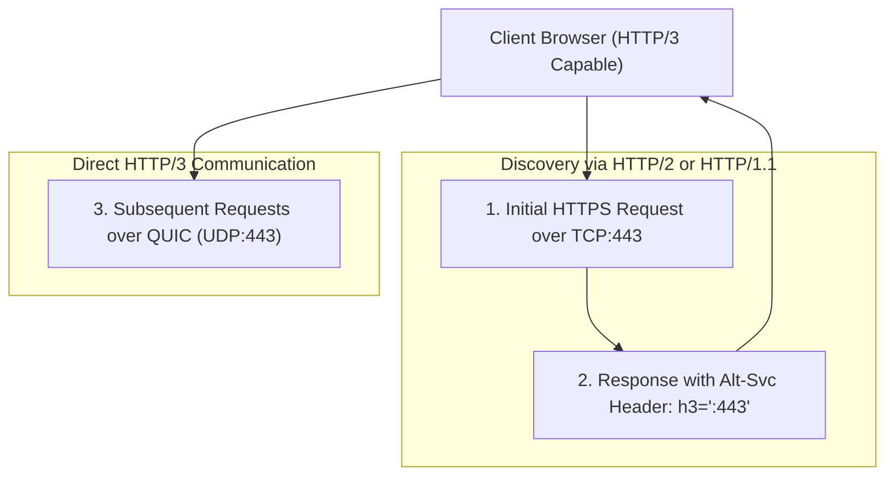

# HTTP/3 & QUIC Configuration

**HTTP/3** is the latest major revision of the HTTP protocol. Unlike HTTP/1.1 and HTTP/2 which run over TCP, HTTP/3 runs over **QUIC**, an encrypted transport protocol based on **UDP**.

---

## Why HTTP/3?

| Problem in HTTP/2 (TCP) | HTTP/3 (QUIC / UDP) Solution |
|:---|:---|
| **Head-of-Line Blocking**: Packet loss in one TCP stream delays all concurrent streams. | **Independent Streams**: Packet loss in one stream does not block or delay other streams. |
| **Connection Handshake**: Requires multiple round-trips (TCP handshake + TLS handshake). | **0-RTT Connection Establishment**: Combined cryptographic and transport handshake. |
| **Connection Migration**: Switching networks (e.g. Wi-Fi to 4G/5G) drops TCP connections. | **Connection ID**: Connections persist uninterrupted across network transitions. |

---

## Architecture Flow



---

## Prerequisites

- Nginx **1.25.0 or newer** (built with `--with-http_v3_module` and `--with-http_quic_module`).
- OpenSSL 1.1.1+ with QUIC support or BoringSSL / Quiche.
- UDP port 443 open on your server firewall.

---

## Server Configuration

```nginx
server {
    # 1. Standard TCP listeners for HTTP/1.1 and HTTP/2
    listen 443 ssl;
    listen [::]:443 ssl;
    http2 on;

    # 2. HTTP/3 QUIC listener over UDP
    listen 443 quic reuseport;
    listen [::]:443 quic reuseport;

    server_name example.com www.example.com;

    # SSL Certificates (TLS 1.3 is MANDATORY for HTTP/3)
    ssl_certificate /etc/letsencrypt/live/example.com/fullchain.pem;
    ssl_certificate_key /etc/letsencrypt/live/example.com/privkey.pem;
    ssl_protocols TLSv1.3;

    # 3. Advertise HTTP/3 support to visiting browsers
    add_header Alt-Svc 'h3=":443"; ma=86400' always;

    # QUIC settings
    quic_retry on;
    ssl_early_data on; # 0-RTT support

    root /var/www/example.com;
    index index.html;

    location / {
        try_files $uri $uri/ =404;
    }
}
```

---

## Firewall Rules for HTTP/3

Remember that QUIC uses **UDP** rather than TCP:

```bash
# UFW (Ubuntu)
sudo ufw allow 443/udp

# Firewalld (RHEL / Rocky)
sudo firewall-cmd --permanent --add-port=443/udp
sudo firewall-cmd --reload
```

---

## Verification

You can verify HTTP/3 operation using `curl` (compiled with HTTP/3 support) or online tools like [HTTP3 Check](https://http3check.net/):

```bash
curl --http3 -I https://example.com
```

In Chrome DevTools, inspect the **Network** tab: the `Protocol` column will show `h3`.

---

[Next: Caching & Compression →](./caching-compression.md)
