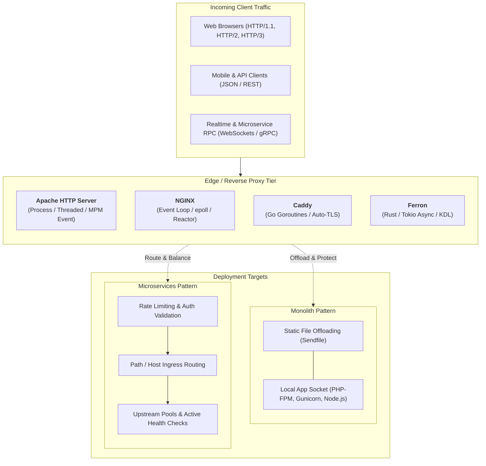

## 🧭 Architectural Landscape

Modern web infrastructure is not one-size-fits-all. As a lead engineer, choosing the right edge and reverse proxy tier dictates your system's connection capacity, memory footprint, operational overhead, and security posture.

---

## 📊 Core Technology Matrix

| Dimension | Apache HTTP Server | NGINX | Caddy | Ferron |
| :--- | :--- | :--- | :--- | :--- |
| **Language** | C | C | Go | Rust |
| **Concurrency Engine** | Process / Thread Pool (`mpm_event`) | Event-driven Non-blocking (`epoll`) | Go M:N Scheduler (Goroutines) | Multi-threaded Async (`Tokio`) |
| **Memory Safety** | Manual C memory management | Manual C memory management | Managed Garbage Collected | Compile-time Rust Borrow Checker |
| **Configuration** | XML-like Apache syntax + `.htaccess` | Declarative block syntax (`nginx.conf`) | Human-readable `Caddyfile` & JSON API | KDL Document Language (`ferron.kdl`) |
| **Automatic TLS** | Manual / Certbot Cron | Manual / Certbot Cron | Native Built-in (ACME / ZeroSSL) | Native Built-in (Let's Encrypt) |
| **HTTP/3 (QUIC)** | Experimental (`mod_md` / `mod_http2`) | Supported (v1.25+) | Native & Default | Supported |
| **Primary Sweet Spot** | Legacy monoliths, dynamic `.htaccess` | High-concurrency edge, static offloading | Developer ergonomics, rapid zero-ops TLS | Memory-critical edge, memory safety |
